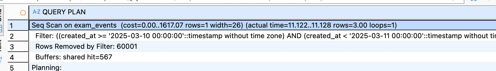
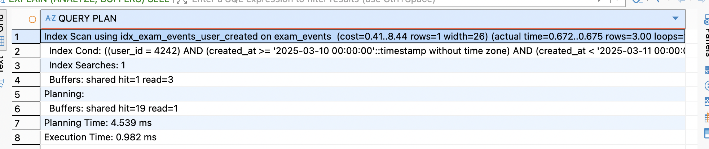
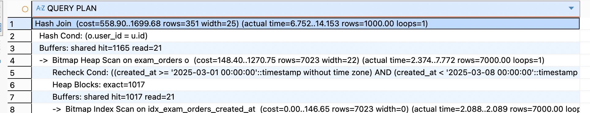
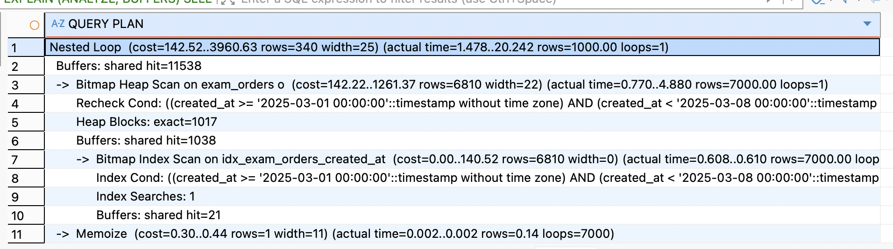
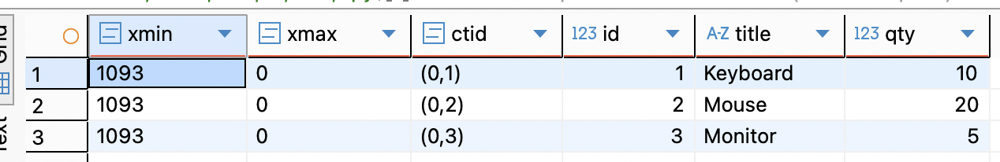
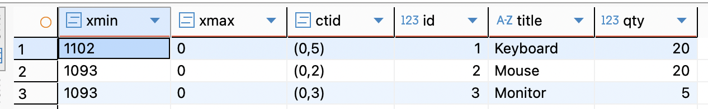
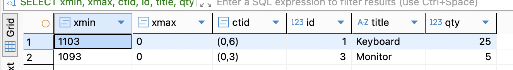

1) оптимизация простого запроса
```
EXPLAIN (ANALYZE, BUFFERS)
SELECT id, user_id, amount, created_at
FROM exam_events
WHERE user_id = 4242
  AND created_at >= TIMESTAMP '2025-03-10 00:00:00'
  AND created_at < TIMESTAMP '2025-03-11 00:00:00';
```


использует seq scan, последовательно перебирает всю таблицу
```
CREATE INDEX idx_exam_events_user_created ON exam_events (user_id, created_at);

EXPLAIN (ANALYZE, BUFFERS)
SELECT id, user_id, amount, created_at
FROM exam_events
WHERE user_id = 4242
AND created_at >= TIMESTAMP '2025-03-10 00:00:00'
AND created_at < TIMESTAMP '2025-03-11 00:00:00';
```

планировщик перешел на Index Scan, теперь быстро находит нужный user_id и сразу фильтрует по диапазону created_at, не читая лишние страницы, стоимость запроса cost и время выполнения actual time снизились

analyze применять нужно чтобы собрать свежую статистику чтобы планировщик точнее оценивал стоимость операций и выбирал оптимальный путь выполнения

2) анализ и улучшение join запроса
```
EXPLAIN (ANALYZE, BUFFERS)
SELECT u.id, u.country, o.amount, o.created_at
FROM exam_users u
JOIN exam_orders o ON o.user_id = u.id
WHERE u.country = 'JP'
  AND o.created_at >= TIMESTAMP '2025-03-01 00:00:00'
  AND o.created_at < TIMESTAMP '2025-03-08 00:00:00';
```

без индекса по user_id в exam_orders планировщику дешевле один раз построить хеш-таблицу из отфильтрованных пользователей/заказов, чем многократно искать строки через полное сканирование

```
CREATE INDEX idx_exam_events_user_created ON exam_events (user_id, created_at);
EXPLAIN (ANALYZE, BUFFERS)
SELECT u.id, u.country, o.amount, o.created_at
FROM exam_users u
JOIN exam_orders o ON o.user_id = u.id
WHERE u.country = 'JP'
  AND o.created_at >= TIMESTAMP '2025-03-01 00:00:00'
  AND o.created_at < TIMESTAMP '2025-03-08 00:00:00';
```


после создания индекса планировщик,на Nested Loop, улучшение произошло за счет того, что для каждой найденной строки `exam_users` теперь  postgre мгновенно находит заказы через индекс избегая тяжелых хеш таблиц

3) при update 
```
SELECT xmin, xmax, ctid, id, title, qty
FROM exam_mvcc_items
ORDER BY id;
```

мы видим, что создало транзакцию с id равным 1093

```
UPDATE exam_mvcc_items
SET qty = qty + 5
WHERE id = 1;

SELECT xmin, xmax, ctid, id, title, qty
FROM exam_mvcc_items
ORDER BY id;
```
изменяем строку

мы видим что id транзакции изменилось с 1093 на 1102, прошлая строка пометилась удаленной и больше не отображается

удаляем строку
```
DELETE FROM exam_mvcc_items
WHERE id = 2;

SELECT xmin, xmax, ctid, id, title, qty
FROM exam_mvcc_items
ORDER BY id;
```


исчезло из select запроса, потому что её xmax - ID транзакции удаления 
меньше или равен номеру текущей транзакции, и она считается невидимой для нового снимка данных
- в модели MVCC обновление создаёт новую версию строки, а не перезаписывает старую, позволяет параллельным транзакциям продолжать читать без блокировок и еще обеспечивает возможность отката изменений


4) g
в A:
```
BEGIN;
SELECT * FROM exam_lock_items WHERE id = 1 FOR SHARE;
```
в B:
```
UPDATE exam_lock_items
SET qty = qty + 1
WHERE id = 1;
```
в А:
```
ROLLBACK;
```


 