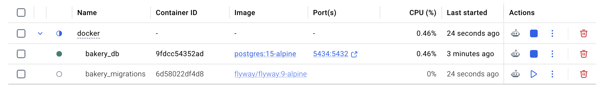
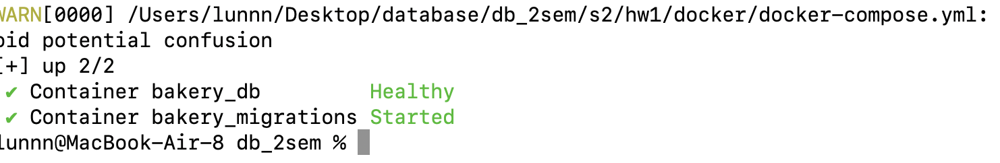
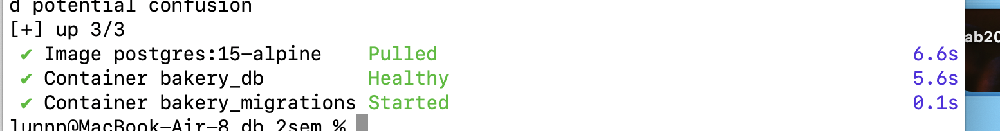
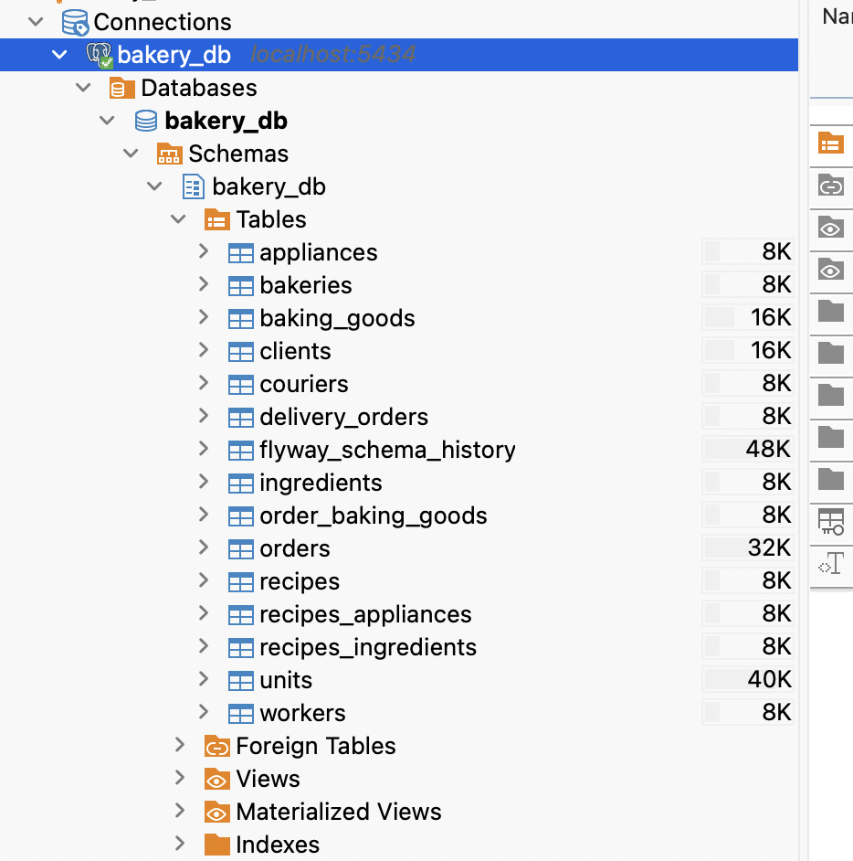
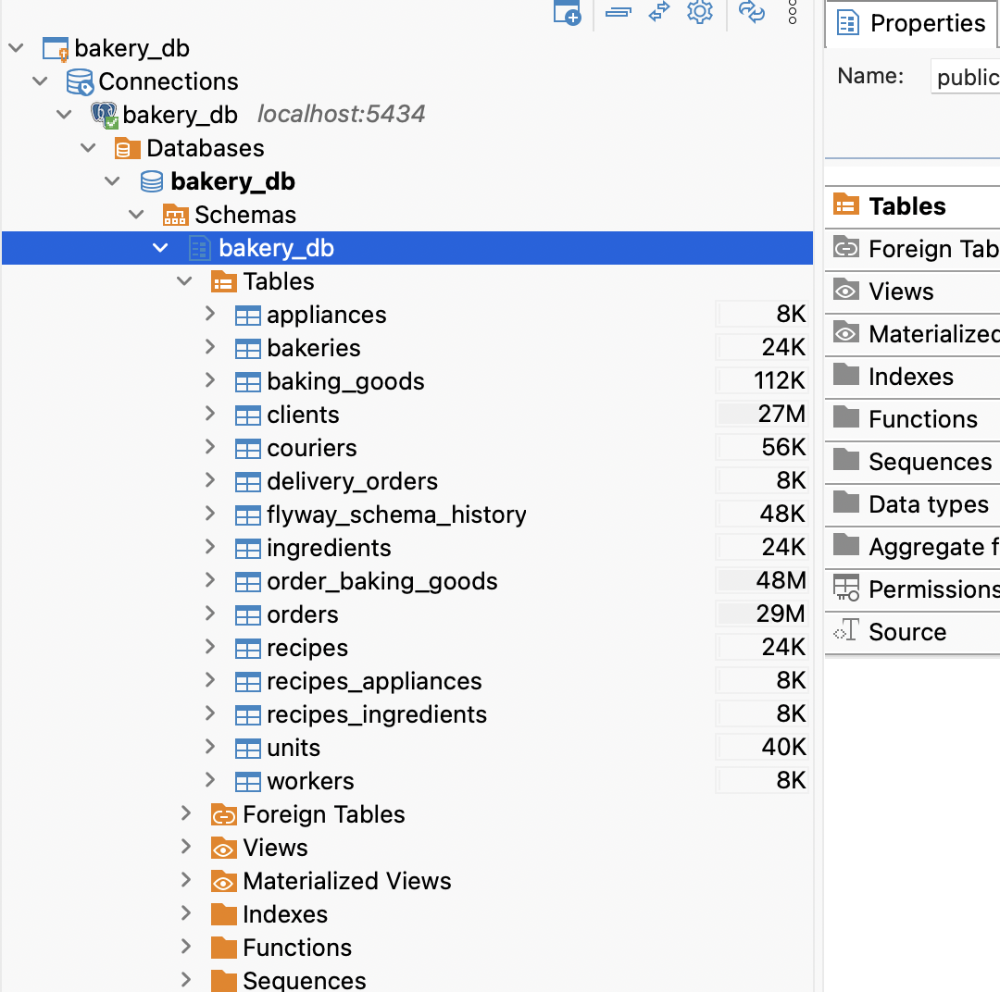
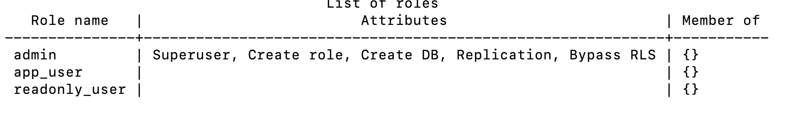
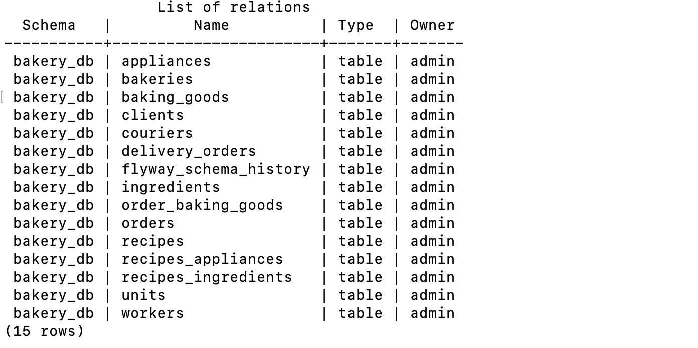

## 1) поднять PostgreSQL в докере
через docker-compose.yaml
```
version: '3.9'

services:
  postgres:
    image: postgres:15-alpine
    container_name: bakery_db
    environment:
      POSTGRES_DB: bakery_db
      POSTGRES_USER: admin
      POSTGRES_PASSWORD: admin123
    ports:
      - "5434:5432"
    volumes:
      - pg_data:/var/lib/postgresql/data
    healthcheck:
      test: ["CMD-SHELL", "pg_isready -U admin -d bakery_db"]
      interval: 5s
      timeout: 5s
      retries: 5

  flyway:
    image: flyway/flyway:9-alpine
    container_name: bakery_migrations
    depends_on:
      postgres:
        condition: service_healthy
    command: -configFile=/flyway/conf/flyway.conf migrate
    volumes:
      - ../flyway/conf:/flyway/conf
      - ../flyway/sql:/flyway/sql

volumes:
  pg_data:

```

и flyway.conf
```
flyway.url=jdbc:postgresql://postgres:5432/bakery_db
flyway.user=admin
flyway.password=admin123
flyway.schemas=bakery_db
flyway.defaultSchema=bakery_db
flyway.locations=filesystem:/flyway/sql
flyway.baselineOnMigrate=true
flyway.outputQueryResults=true
```

запускаем контейнер:
```
docker compose -f s2/hw1/docker/docker-compose.yml up -d
```



пробуем подключиться к бд
```
docker exec -it bakery_db psql -U admin -d bakery_db
```
все работает

## 2)миграции, создать роли и выдать права
первая миграция V1 - создание таблиц, также выдача прав и ролей
```
GRANT USAGE ON SCHEMA bakery_db TO app_user, readonly_user;
GRANT SELECT, INSERT, UPDATE, DELETE ON ALL TABLES IN SCHEMA bakery_db TO app_user;
GRANT USAGE, SELECT ON ALL SEQUENCES IN SCHEMA bakery_db TO app_user;
GRANT SELECT ON ALL TABLES IN SCHEMA bakery_db TO readonly_user;
ALTER DEFAULT PRIVILEGES IN SCHEMA bakery_db GRANT SELECT, INSERT, UPDATE, DELETE ON TABLES TO app_user;
ALTER DEFAULT PRIVILEGES IN SCHEMA bakery_db GRANT USAGE, SELECT ON SEQUENCES TO app_user;
ALTER DEFAULT PRIVILEGES IN SCHEMA bakery_db GRANT SELECT ON TABLES TO readonly_user;
```
ALTER DEFAULT PRIVILEGES - выдача прав на таблицы заранее


## 3)генерация данных через Sql
результат:

проверим:
```
#таблицы
docker exec -it bakery_db psql -U admin -d bakery_db -c "\dt bakery_db.*"

#oбъём данных
docker exec -it bakery_db psql -U admin -d bakery_db -c "SELECT relname, n_live_tup FROM pg_stat_user_tables WHERE schemaname='bakery_db' ORDER BY n_live_tup DESC;"

#роли
docker exec -it bakery_db psql -U admin -d bakery_db -c "\du"
```



## 4)проверка ролей
**Тест 1: app_user (пароль: app_secret)**
- вставка (должна сработать):
```
INSERT INTO bakery_db.clients (last_name, first_name, phone_number) VALUES ('TestApp', 'User', '+79000000000'); 
```


- удаление таблицы (должна быть ошибка):
```
DROP TABLE bakery_db.clients; 
```


Тест 2: readonly_user (пароль: ro_secret)
- чтение(должно сработать)
```
SELECT count(*) FROM bakery_db.orders; 
```

- вставка(должна быть ошибка)
```
INSERT INTO bakery_db.orders (client_id, bakery_id, type_of_order) VALUES (1, 1, 'Test'); 
```

