запускаем контейнер и бд:
```

docker compose -f s2/hw1/docker/docker-compose.yml up -d
docker exec -it bakery_db psql -U admin -d bakery_db
```
## 1) точное совпадение(=)
**запрос:**
```
SELECT client_id, last_name, first_name 
FROM clients 
WHERE phone_number = '+7 (945) 123-45-67';
```

- **без индекса:**
```
EXPLAIN (ANALYZE, BUFFERS) SELECT client_id, last_name, first_name 
FROM clients 
WHERE phone_number = '+7 (945) 123-45-67';
```
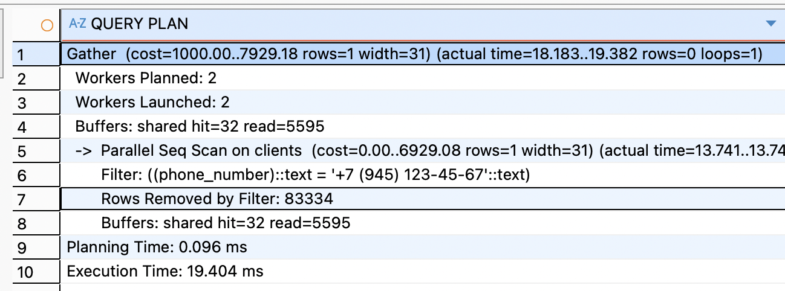
**итог:** планировщик выбирает Seq Scan, читаются все страницы таблицы, время выполнения пропорционально размеру таблицы.

- **с B-tree индексом:**
```
CREATE INDEX idx_clients_phone_bt ON clients(phone_number);
EXPLAIN (ANALYZE, BUFFERS) SELECT client_id, last_name, first_name 
FROM clients 
WHERE phone_number = '+7 (945) 123-45-67';

```
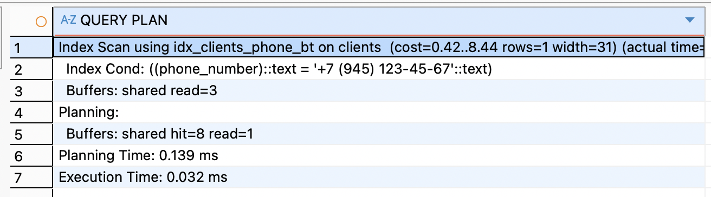
**итог:**  используется Index Scan, shared read падает до 3, резкое ускорение за счет логарифмического поиска.

- **с Hash индексом:**
```
CREATE INDEX idx_clients_phone_hash ON clients USING HASH(phone_number);
EXPLAIN (ANALYZE, BUFFERS) SELECT client_id, last_name, first_name 
FROM clients 
WHERE phone_number = '+7 (945) 123-45-67';
```
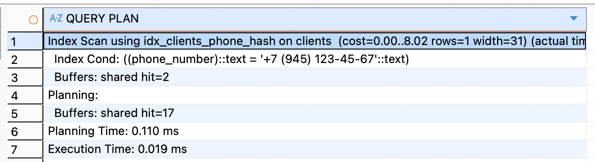
**итог:** Hash индекс также позволяет избежать Seq Scan и работает быстрее B-tree на чистом равенстве, но поддерживает только оператор =
## 2)Оператор >
### запрос на ``>``:
```
SELECT order_id, client_id, type_of_order 
FROM orders 
WHERE order_id > 340000;
```
- **без индекса:**
```
EXPLAIN (ANALYZE, BUFFERS)
SELECT order_id, client_id, type_of_order 
FROM bakery_db.orders 
WHERE order_id > 340000;
```
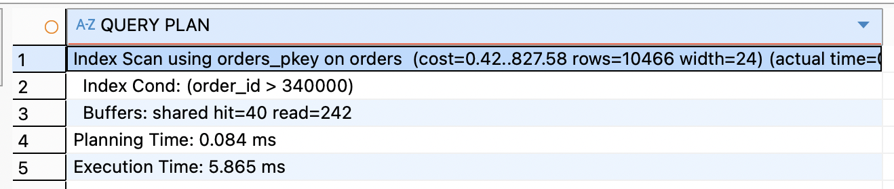
**итог:** shared read=242 - много чтений с диска

- **B-tree  индекс:**
```
CREATE INDEX idx_orders_id_bt ON bakery_db.orders(order_id);
EXPLAIN (ANALYZE, BUFFERS)
SELECT order_id, client_id, type_of_order 
FROM bakery_db.orders 
WHERE order_id > 340000;
```
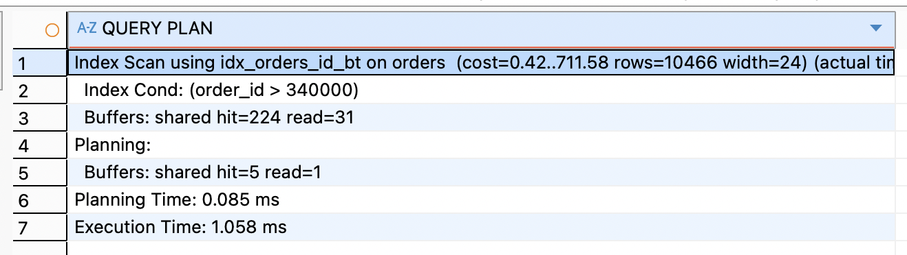
**итог:** в 5.5 раз быстрее (5.865 ms → 1.058 ms), shared read упало с 242 до 31 - в 8 раз меньше чтений с диска

- **Hash-индекс**
```
CREATE INDEX idx_orders_id_hash ON bakery_db.orders USING HASH(order_id);
EXPLAIN (ANALYZE, BUFFERS)
SELECT order_id, client_id, type_of_order 
FROM bakery_db.orders 
WHERE order_id > 340000;
```
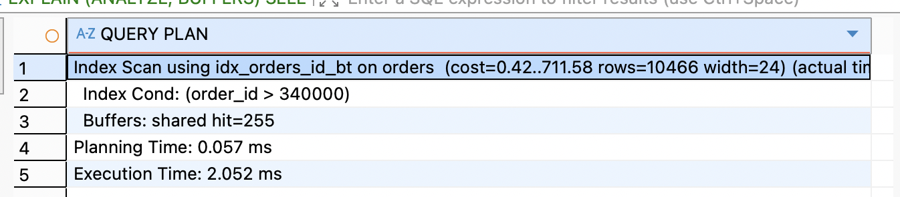
**итог:** PostgreSQL проигнорировал Hash индекс, вместо него снова использовался B-tree Hash индекс не поддерживает оператор `>`

## 3) запрос на LIKE 'prefix%':
запрос:
```
SELECT last_name, phone_number 
FROM bakery_db.clients 
WHERE last_name LIKE 'Иван%';
```

- **без индекса:**
```
EXPLAIN (ANALYZE, BUFFERS)
SELECT last_name, phone_number 
FROM bakery_db.clients 
WHERE last_name LIKE 'Иван%';
```
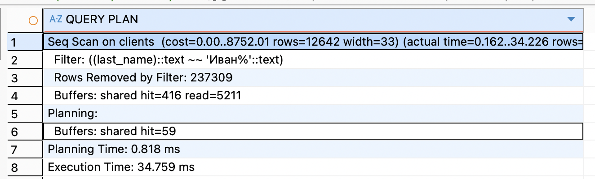
- **B-tree  индекс:**
```
CREATE INDEX idx_clients_lastname_bt ON bakery_db.clients(last_name);
EXPLAIN (ANALYZE, BUFFERS)
SELECT last_name, phone_number 
FROM bakery_db.clients 
WHERE last_name LIKE 'Иван%';
```
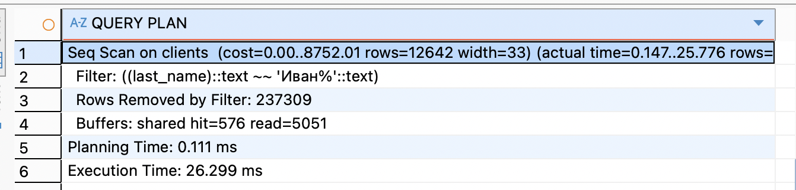
- **Hash индекс**:
```
CREATE INDEX idx_clients_lastname_hash ON bakery_db.clients USING HASH(last_name);
EXPLAIN (ANALYZE, BUFFERS)
SELECT last_name, phone_number 
FROM bakery_db.clients 
WHERE last_name LIKE 'Иван%';
```
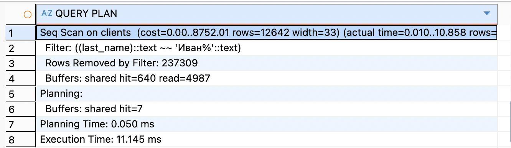
**итог:** запрос возвращает 12,642 строки из ~250,000 (примерно 5% таблицы)
при такой селективности планировщик считает, что дешевле прочитать таблицу целиком, чем делать множество случайных обращений через индекс - это нормальное поведение для PostgreSQL, Hash индекс не поддерживает LIKE
а время показывало меньше тк сохраняет в кэш, в следующих пунктах будем применять
```
docker exec -it bakery_db psql -U admin -d bakery_db -c "DISCARD ALL;"
```
### 4) запрос на ``IN``:
запрос:
```
SELECT order_id, bakery_id, type_of_order 
FROM bakery_db.orders 
WHERE bakery_id IN (1, 2, 3, 4, 5);
```
- **без индекса**
```
EXPLAIN (ANALYZE, BUFFERS)
SELECT order_id, bakery_id, type_of_order 
FROM bakery_db.orders 
WHERE bakery_id IN (1, 2, 3, 4, 5);
```
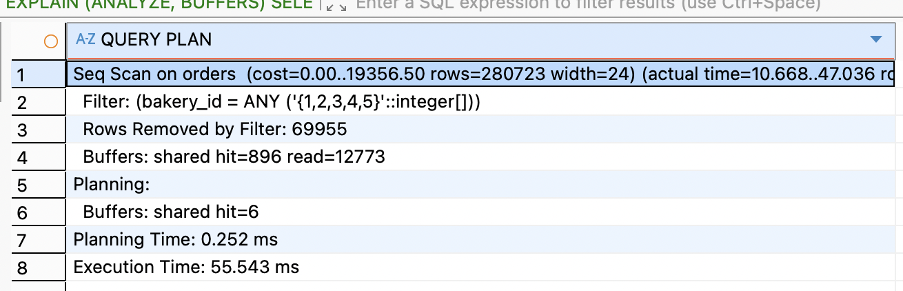
- **с B-tree индексом**
```
CREATE INDEX idx_orders_bakery_bt ON bakery_db.orders(bakery_id);
EXPLAIN (ANALYZE, BUFFERS)
SELECT order_id, bakery_id, type_of_order 
FROM bakery_db.orders 
WHERE bakery_id IN (1, 2, 3, 4, 5);
```
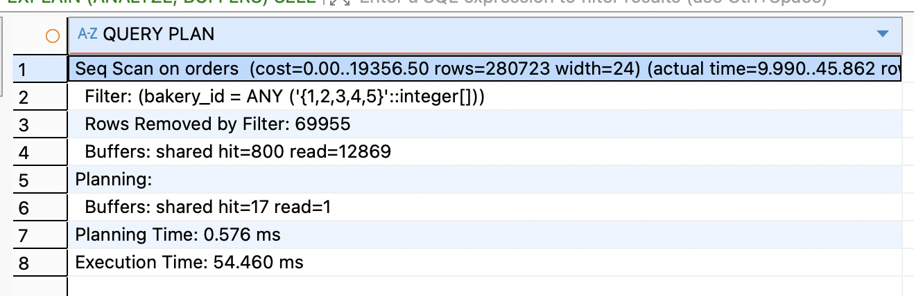
- **c Hash индексом**
```
CREATE INDEX idx_orders_bakery_hash ON bakery_db.orders USING HASH(bakery_id);
EXPLAIN (ANALYZE, BUFFERS)
SELECT order_id, bakery_id, type_of_order 
FROM bakery_db.orders 
WHERE bakery_id IN (1, 2, 3, 4, 5);
```
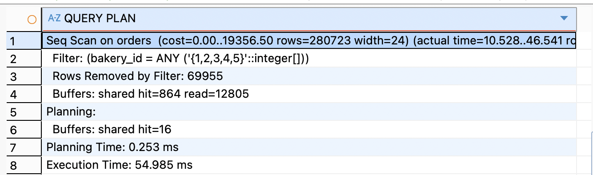
итог: везде Seq Scan тк запрос возвращает 80% таблицы

### 5) запрос на < :
запрос:
```
SELECT client_id, last_name, first_name, birth_date
FROM bakery_db.clients
WHERE birth_date < '1962-01-01';
```
- без индекса
```
EXPLAIN (ANALYZE, BUFFERS)
SELECT client_id, last_name, first_name, birth_date
FROM bakery_db.clients
WHERE birth_date < '1962-01-01';
```
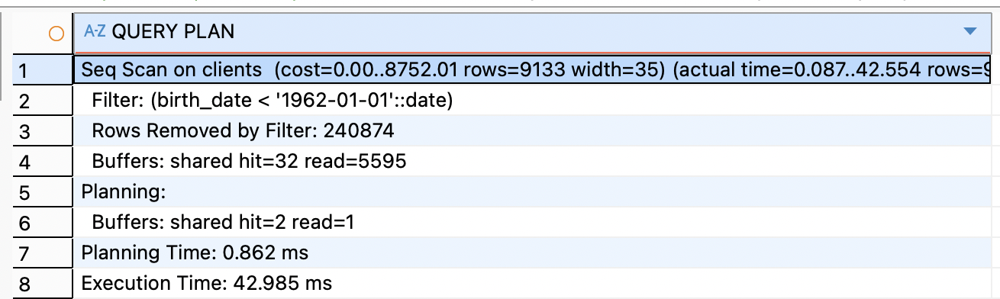
итог: PstgreSQL прочитал всю таблицу(5595 страниц с диска), отфильтровал 240,874 строки, оставив 9,133 (~3.6% данных)
- с B-tree индексом
```
CREATE INDEX idx_clients_birthdate_bt ON bakery_db.clients(birth_date);
DISCARD ALL;
EXPLAIN (ANALYZE, BUFFERS)
SELECT client_id, last_name, first_name, birth_date
FROM bakery_db.clients
WHERE birth_date < '1962-01-01';
```
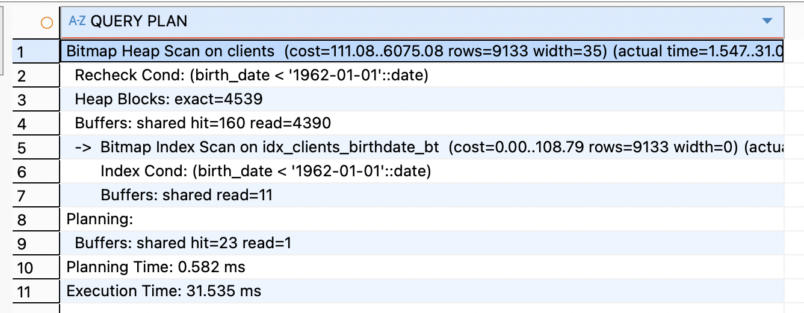
итог: Bitmap Index Scan нашёл нужные страницы через индекс (всего 11 чтений), Bitmap Heap Scan прочитал только нужные блоки таблицы, shared read сократился с 5595 до 4390 (на 21% меньше), время выполнения: 42.985 ms → 31.535 ms (на 27% быстрее)

- с Hash индексом
```
CREATE INDEX idx_clients_birthdate_hash ON bakery_db.clients USING HASH(birth_date);
DISCARD ALL;
EXPLAIN (ANALYZE, BUFFERS)
SELECT client_id, last_name, first_name, birth_date 
FROM bakery_db.clients 
WHERE birth_date < '1962-01-01';
```
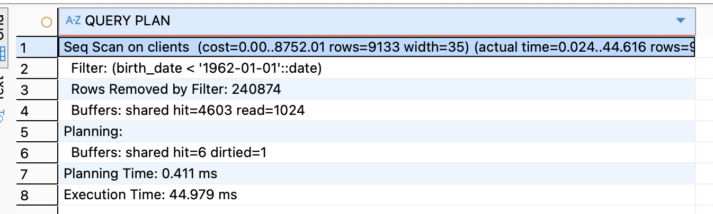
итог: Hash индекс не поддержал оператор <, планировщик вернулся к `Seq Scan`