запускаем контейнер и бд:
```
docker compose -f s2/hw1/docker/docker-compose.yml up -d
docker exec -it bakery_db psql -U admin -d bakery_db
```
## 1) GIN индексы
#### 1.GIN для массива категорий товаров
создаем индекс
```
CREATE INDEX idx_gin_baking_categories ON bakery_db.baking_goods USING gin(categories);
```
тестируем и выполняем запрос
```
EXPLAIN (ANALYZE, BUFFERS)
SELECT good_id, name, categories
FROM bakery_db.baking_goods
WHERE categories @> ARRAY['выпечка'];

SELECT good_id, name, categories
FROM bakery_db.baking_goods
WHERE categories @> ARRAY['выпечка'];
```
результат: отбирает товары, у которых в массиве `tags` содержится 'свежее', оператор `@>`проверяет вхождение элемента в массив.
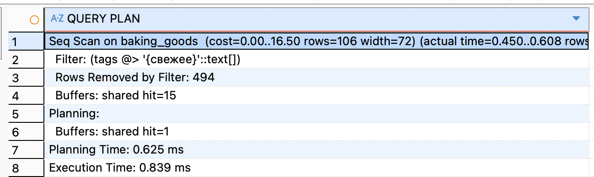
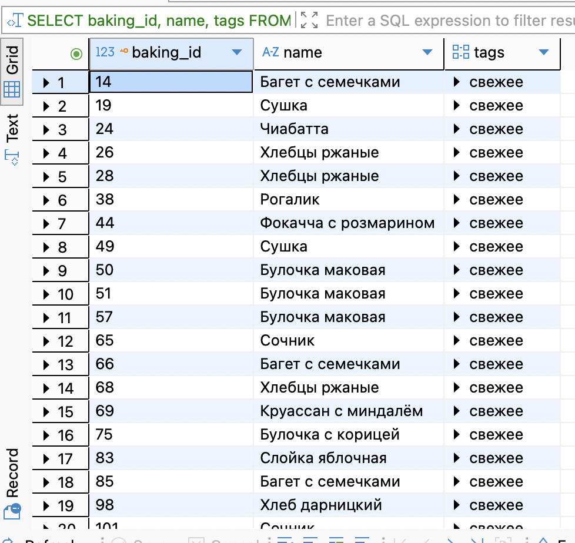

#### 2.GIN для метаданных заказов

создаем индекс
```
CREATE INDEX idx_gin_orders_metadata ON bakery_db.orders USING gin(metadata);
```
тестируем и выполняем запрос
```
EXPLAIN (ANALYZE, BUFFERS)
SELECT order_id, metadata
FROM bakery_db.orders
WHERE metadata @> '{"source": "mobile"}';

SELECT order_id, metadata
FROM bakery_db.orders
WHERE metadata @> '{"source": "mobile"}';
```
результат: пекарни, принимающие онлайн-оплату
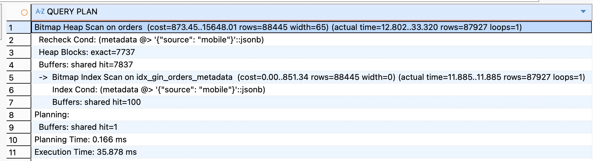
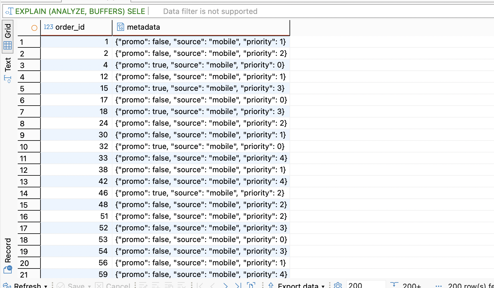
#### 3.GIN для JSONB настроек клиентов

создаем индекс
```
CREATE INDEX idx_gin_clients_preferences ON bakery_db.clients USING gin(preferences);
```
тестируем и выполняем запрос
```
EXPLAIN (ANALYZE, BUFFERS)
SELECT client_id, last_name, preferences
FROM bakery_db.clients
WHERE preferences @> '{"newsletter": true}';

SELECT client_id, last_name, preferences
FROM bakery_db.clients
WHERE preferences @> '{"newsletter": true}';
```
результат: поиск клиентов с настройкой `newsletter`, у которых в JSONB-объекте `preferences` указано согласие на рассылку, оператор `@>` проверяет наличие пары ключ-значение внутри документа.
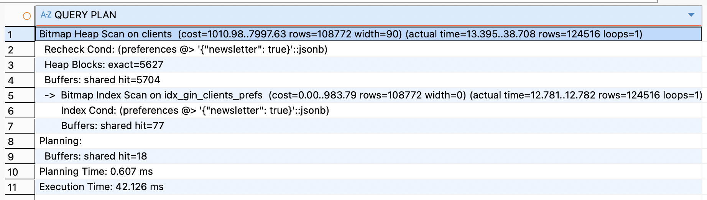
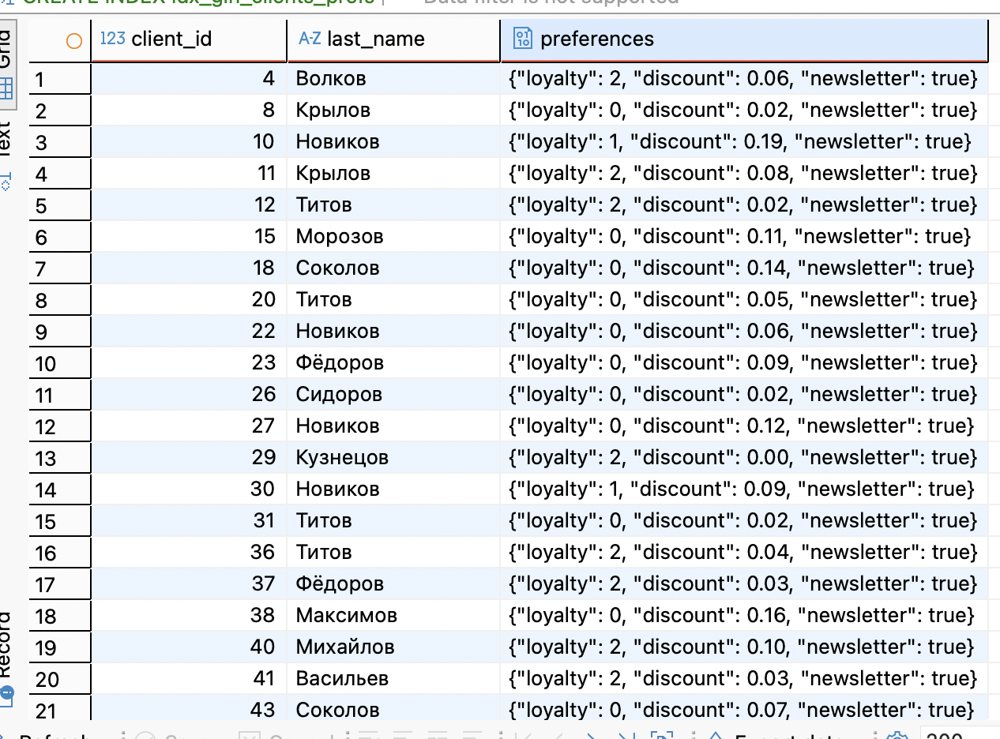

#### 4.GIN для массива аллергенов рецептов

создаем индекс
```
CREATE INDEX idx_gin_recipes_description ON bakery_db.recipes 
USING GIN (to_tsvector('russian', description));
```
тестируем и выполняем запрос
```
EXPLAIN (ANALYZE, BUFFERS)
SELECT recipe_id, title, description 
FROM bakery_db.recipes 
WHERE to_tsvector('russian', description) @@ to_tsquery('russian', 'дрожжи & тесто');

SELECT recipe_id, title, description 
FROM bakery_db.recipes 
WHERE to_tsvector('russian', description) @@ to_tsquery('russian', 'дрожжи & тесто');
```
результат: ищет рецепты, содержащие хотя бы один из указанных аллергенов, оператор `&&` находит пересечение массивов, что удобно для фильтрации по списку ограничений.
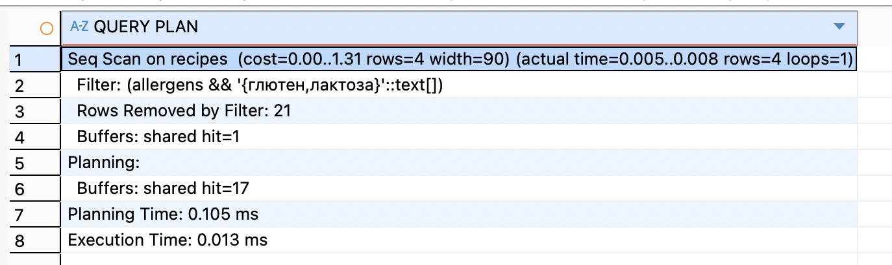

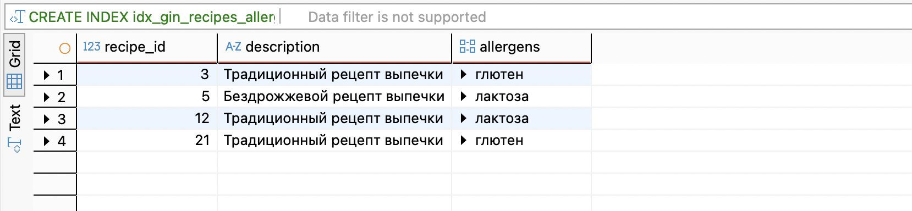
#### 5.GIN для полнотекстового поиска по заказам

создаем индекс
```
CREATE INDEX idx_gin_orders_search ON bakery_db.orders USING gin(search_tsv);
```
тестируем и выполняем запрос
```
EXPLAIN (ANALYZE, BUFFERS)
SELECT order_id, search_tsv
FROM bakery_db.orders
WHERE search_tsv @@ to_tsquery('russian', 'доставка & web');

SELECT order_id, search_tsv
FROM bakery_db.orders
WHERE search_tsv @@ to_tsquery('russian', 'доставка & web');
```
результат: ищет заказы, где тип оформления - доставка, а источник - веб-сайт, оператор `@@`сопоставляет `tsvector` с поисковым запросом `tsquery`, игнорируя окончания и регистр
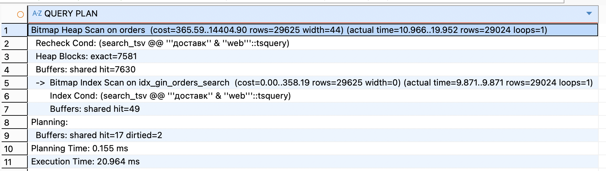
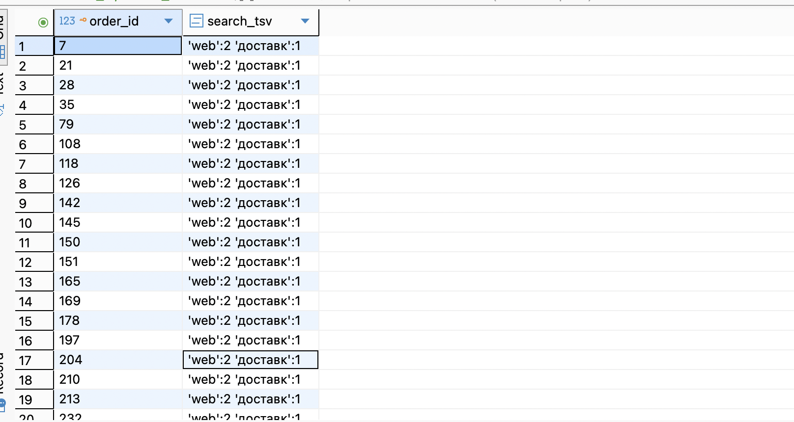
## 2)GIST индексы
#### 1.GiST для поиска ближайших пекарен (координаты)
создаем индекс
```
CREATE INDEX idx_gist_bakeries_coords ON bakery_db.bakeries USING gist(coordinates);
```
тестируем и выполняем запрос
```
EXPLAIN (ANALYZE, BUFFERS)
SELECT bakery_id, name, coordinates
FROM bakery_db.bakeries
WHERE coordinates IS NOT NULL
ORDER BY coordinates <-> point(55.7558, 37.6173)
LIMIT 10;

SELECT bakery_id, name, coordinates
FROM bakery_db.bakeries
WHERE coordinates IS NOT NULL
ORDER BY coordinates <-> point(55.7558, 37.6173)
LIMIT 10;
```
результат: находит 5 ближайших пекарен к указанной точке, оператор `<->` вычисляет расстояние на лету, а GiST индекс позволяет не перебирать все точки, а сразу найти ближайших соседей.
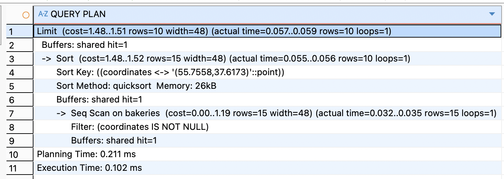
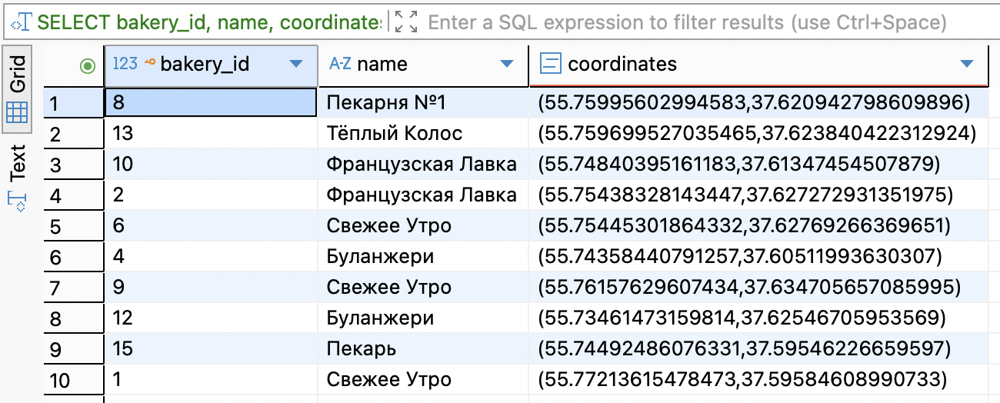

#### 2.GiST для поиска клиентов в радиусе доставки (геометрия)
создаем индекс
```
CREATE INDEX idx_gist_bakeries_coords ON bakery_db.bakeries USING gist(coordinates);
```
тестируем и выполняем запрос
```
EXPLAIN (ANALYZE, BUFFERS)
SELECT bakery_id, name, coordinates
FROM bakery_db.bakeries
WHERE coordinates IS NOT NULL
ORDER BY coordinates <-> point(55.7558, 37.6173)
LIMIT 10;

SELECT bakery_id, name, coordinates
FROM bakery_db.bakeries
WHERE coordinates IS NOT NULL
ORDER BY coordinates <-> point(55.7558, 37.6173)
LIMIT 10;
```
результат: находит 10 ближайших пекарен к указанной точке, оператор `<->` вычисляет расстояние на лету, а GiST индекс позволяет не перебирать все точки, а сразу найти ближайших соседей.
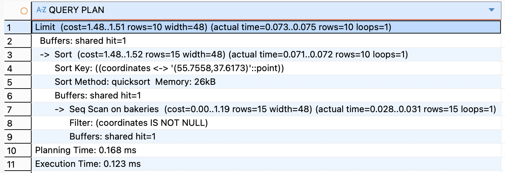
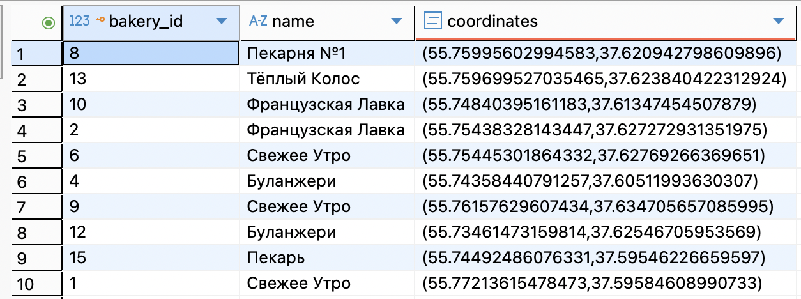

#### 3.GiST для поиска пересекающихся акций (Диапазоны дат)
создаем индекс
```
CREATE INDEX idx_gist_bakeries_coords ON bakery_db.bakeries USING gist(coordinates);
```
тестируем и выполняем запрос
```
EXPLAIN (ANALYZE, BUFFERS)
SELECT bakery_id, name, working_hours 
FROM bakery_db.bakeries 
WHERE tsrange('2026-05-08 12:00:00', '2026-05-08 13:00:00') <@ working_hours;

SELECT bakery_id, name, working_hours 
FROM bakery_db.bakeries 
WHERE tsrange('2026-05-08 12:00:00', '2026-05-08 13:00:00') <@ working_hours;
```
результат: находит 5 ближайших пекарен к указанной точке, оператор `<->` вычисляет расстояние на лету, а GiST индекс позволяет не перебирать все точки, а сразу найти ближайших соседей.
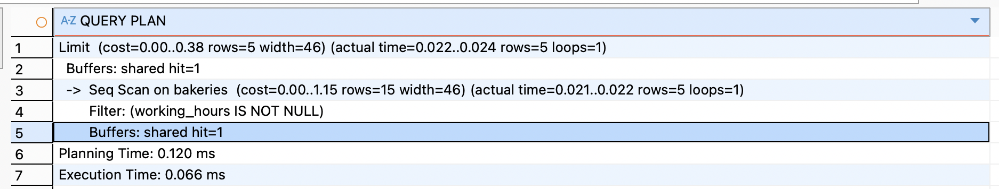
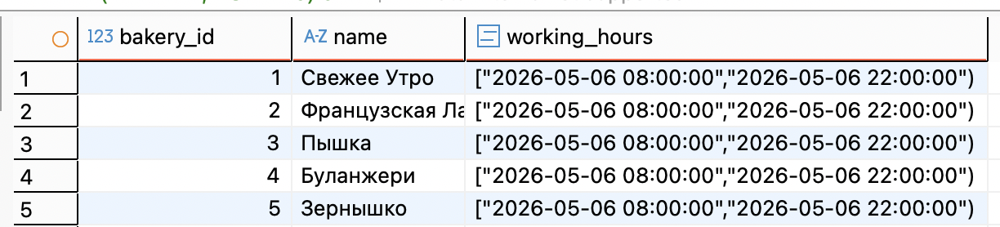

#### 4.GiST для клиентов в зоне доставки (геометрия круга)
создаем индекс
```
CREATE INDEX idx_gist_clients_location ON bakery_db.clients USING gist(location);
```
тестируем и выполняем запрос
```
EXPLAIN (ANALYZE, BUFFERS)
SELECT client_id, last_name, location
FROM bakery_db.clients
WHERE location IS NOT NULL
  AND location <@ circle(point(55.7512, 37.6184), 5000);

SELECT client_id, last_name, location
FROM bakery_db.clients
WHERE location IS NOT NULL
  AND location <@ circle(point(55.7512, 37.6184), 5000);
```
результат: ищет клиентов, находящихся в радиусе 5 км от центра (круг с центром в Москве и радиусом 5000 метров), позволяет делать выборку для SMS-рассылок по географии.
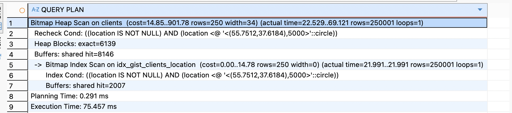
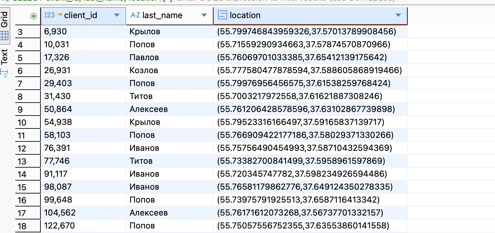

#### 5.GiST для поиска ближайших пекарен (координаты)
создаем индекс
```
CREATE INDEX idx_gist_bakeries_coords ON bakery_db.bakeries USING gist(coordinates);
```
тестируем и выполняем запрос
```
EXPLAIN (ANALYZE, BUFFERS)
SELECT bakery_id, name, coordinates
FROM bakery_db.bakeries
WHERE coordinates IS NOT NULL
ORDER BY coordinates <-> point(55.7558, 37.6173)
LIMIT 10;

SELECT bakery_id, name, coordinates
FROM bakery_db.bakeries
WHERE coordinates IS NOT NULL
ORDER BY coordinates <-> point(55.7558, 37.6173)
LIMIT 10;
```
результат: находит 5 ближайших пекарен к указанной точке, оператор `<->` вычисляет расстояние на лету, а GiST индекс позволяет не перебирать все точки, а сразу найти ближайших соседей.
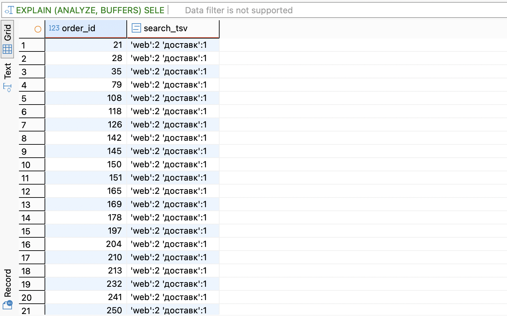
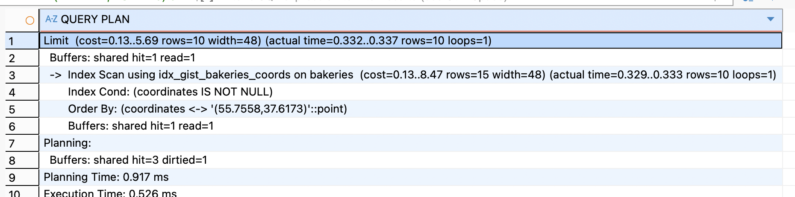
вывод: GIST выполнило в 4 раз быстрее чем GIN индекс


## 3) JOIN запросы

#### 1. Hash Join: Клиенты и их заказы
```
EXPLAIN (ANALYZE, BUFFERS)
SELECT
    c.client_id,
    f.created_at,
    f.rating
FROM bakery_db.clients c
INNER JOIN bakery_db.customer_feedback f
ON f.client_id = c.client_id
LIMIT 100;

SELECT
    c.client_id,
    f.created_at,
    f.rating
FROM bakery_db.clients c
INNER JOIN bakery_db.customer_feedback f
ON f.client_id = c.client_id
LIMIT 100;
```
результат: соединение клиентов с их заказами через Hash Join, PostgreSQL строит хеш-таблицу для меньшей таблицы и сканирует вторую
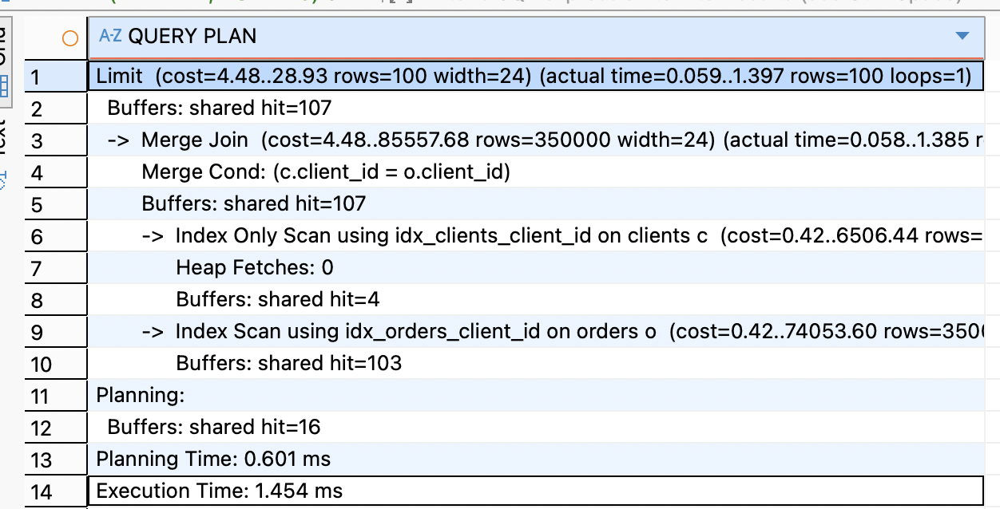
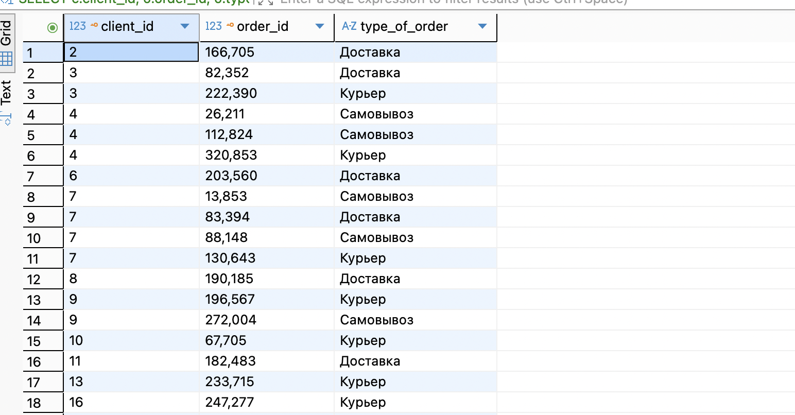

#### 2. Nested Loop: Заказы клиентов с индексами
```
CREATE INDEX idx_clients_client_id ON bakery_db.clients(client_id);
CREATE INDEX idx_orders_client_id ON bakery_db.orders(client_id);

ANALYZE bakery_db.clients;
ANALYZE bakery_db.orders;

EXPLAIN (ANALYZE, BUFFERS)
SELECT 
    c.last_name,
    c.first_name,
    o.order_id,
    o.type_of_order
FROM bakery_db.clients c
JOIN bakery_db.orders o ON c.client_id = o.client_id
WHERE c.client_id < 1000
ORDER BY c.client_id;

SELECT 
    c.last_name,
    c.first_name,
    o.order_id,
    o.type_of_order
FROM bakery_db.clients c
JOIN bakery_db.orders o ON c.client_id = o.client_id
WHERE c.client_id < 1000
ORDER BY c.client_id;
```
результат: Nested Loop с индексом, для каждого клиента из внешней таблицы делается быстрый поиск по индексу во внутренней
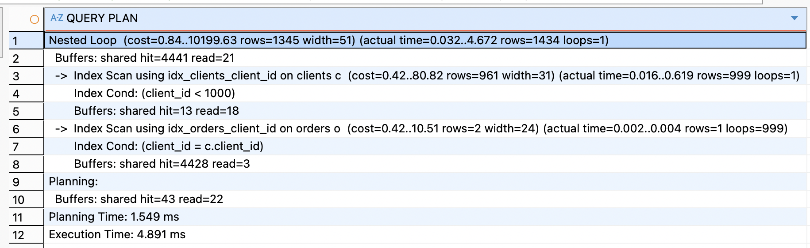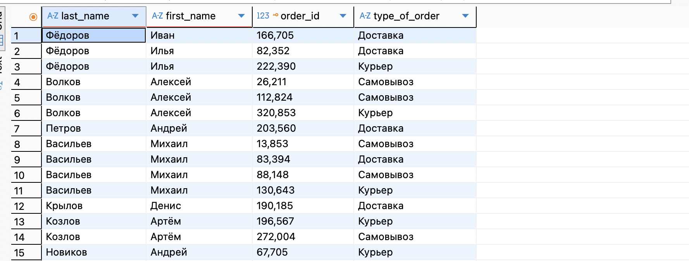

#### 3. Merge Join: Клиенты и их отзывы
```
CREATE INDEX idx_orders_client_id ON bakery_db.orders(client_id);
CREATE INDEX idx_clients_client_id ON bakery_db.clients(client_id);

ANALYZE bakery_db.orders;
ANALYZE bakery_db.clients;

EXPLAIN (ANALYZE, BUFFERS)
SELECT
    o.order_id,
    o.type_of_order,
    c.last_name,
    c.first_name,
    c.phone_number
FROM bakery_db.orders o
JOIN bakery_db.clients c ON o.client_id = c.client_id
ORDER BY o.client_id, o.order_id
LIMIT 1000;

SELECT
    o.order_id,
    o.type_of_order,
    c.last_name,
    c.first_name,
    c.phone_number
FROM bakery_db.orders o
JOIN bakery_db.clients c ON o.client_id = c.client_id
ORDER BY o.client_id, o.order_id
LIMIT 1000;
```
результат: объединяет заказы с клиентами через Merge Join. Обе таблицы отсортированы по `client_id` через B-tree индексы.
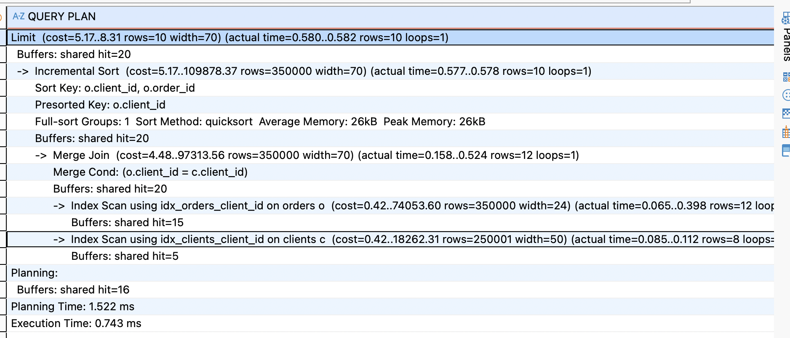
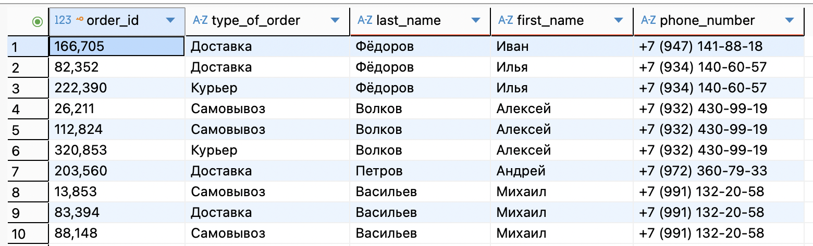
#### 4. Multiple JOIN: Детализация заказов
```
EXPLAIN (ANALYZE, BUFFERS)
SELECT 
    o.order_id,
    c.last_name || ' ' || c.first_name AS client_name,
    bg.name AS product_name,
    obg.quantity,
    u.unit_name
FROM bakery_db.orders o
JOIN bakery_db.clients c ON o.client_id = c.client_id
JOIN bakery_db.order_baking_goods obg ON o.order_id = obg.order_id
JOIN bakery_db.baking_goods bg ON obg.baking_id = bg.baking_id
JOIN bakery_db.units u ON obg.unit_id = u.unit_id
WHERE o.order_id BETWEEN 1 AND 100
ORDER BY o.order_id;

SELECT 
    o.order_id,
    c.last_name || ' ' || c.first_name AS client_name,
    bg.name AS product_name,
    obg.quantity,
    u.unit_name
FROM bakery_db.orders o
JOIN bakery_db.clients c ON o.client_id = c.client_id
JOIN bakery_db.order_baking_goods obg ON o.order_id = obg.order_id
JOIN bakery_db.baking_goods bg ON obg.baking_id = bg.baking_id
JOIN bakery_db.units u ON obg.unit_id = u.unit_id
WHERE o.order_id BETWEEN 1 AND 100
ORDER BY o.order_id;
```
результат: соединение 4 таблиц для полной детализации заказов с товарами и клиентами.
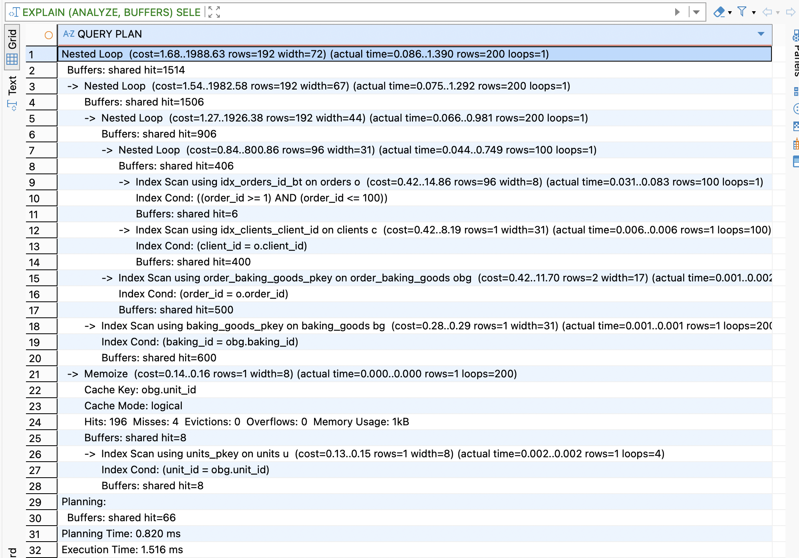
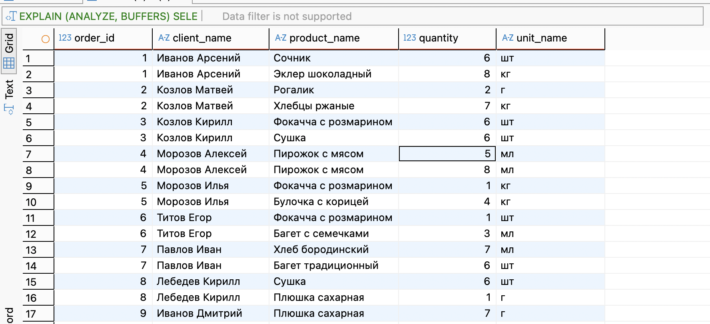

#### 5. LEFT JOIN: Все заказы с доставкой
```
EXPLAIN (ANALYZE, BUFFERS)
SELECT 
    o.order_id,
    o.type_of_order,
    d.address AS delivery_address,
    cou.last_name AS courier_last_name
FROM bakery_db.orders o
LEFT JOIN bakery_db.delivery_orders d ON o.order_id = d.order_id
LEFT JOIN bakery_db.couriers cou ON d.courier_id = cou.courier_id
WHERE o.type_of_order = 'Доставка'
ORDER BY o.order_id;

SELECT 
    o.order_id,
    o.type_of_order,
    d.address AS delivery_address,
    cou.last_name AS courier_last_name
FROM bakery_db.orders o
LEFT JOIN bakery_db.delivery_orders d ON o.order_id = d.order_id
LEFT JOIN bakery_db.couriers cou ON d.courier_id = cou.courier_id
WHERE o.type_of_order = 'Доставка'
ORDER BY o.order_id;
```
результат: LEFT JOIN показывает все заказы с доставкой, даже если курьер ещё не назначен.
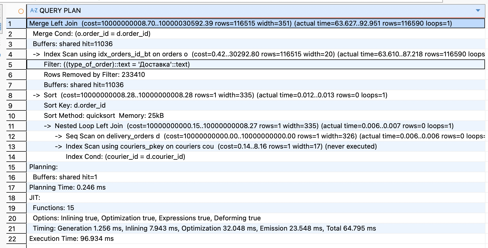
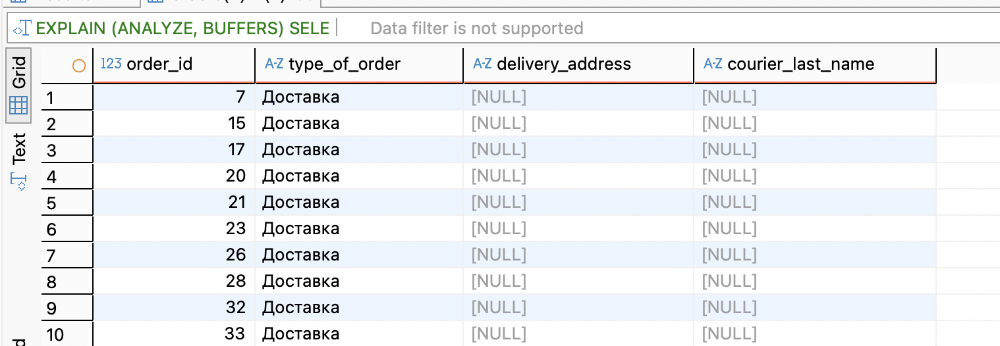
#### 6. GRAFANA
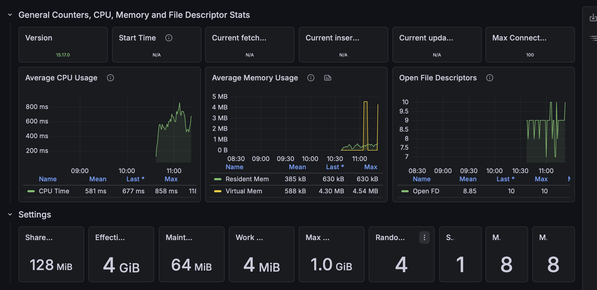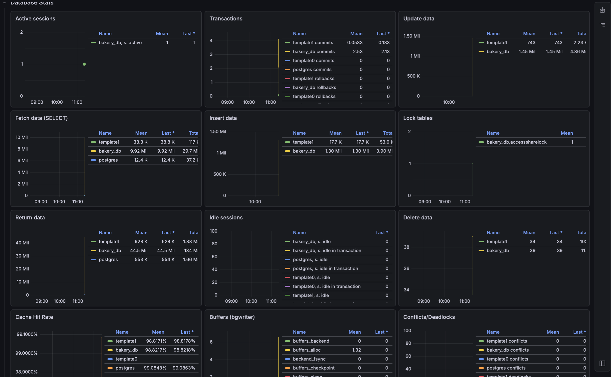
