запускаем контейнер и бд:
```
docker compose -f s2/hw1/docker/docker-compose.yml up -d
docker exec -it bakery_db psql -U admin -d bakery_db
```
## 1)моделирование обновления данных и просмотр системных полей
**подготовка:**
```
SET search_path TO bakery_db;
CREATE EXTENSION IF NOT EXISTS pageinspect;

SELECT txid_current() AS current_txid;
```

**до обновления:**
```
SELECT
client_id,
ctid,
xmin,
xmax,
last_name
FROM clients
WHERE client_id = 1;
```
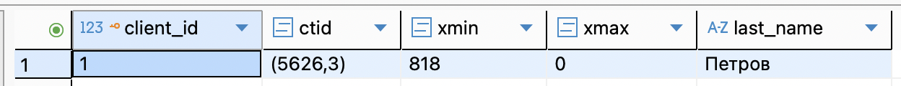

**симулируем update:**
```
BEGIN;
UPDATE clients 
SET last_name = 'Обновлённый' 
WHERE client_id = 1;
COMMIT;
```
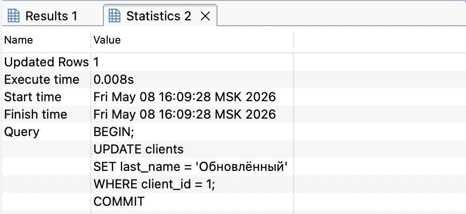

**смотрим после обновления:**
```
SELECT
client_id,
ctid,
xmin,
xmax,
last_name
FROM clients
WHERE client_id = 1;
```
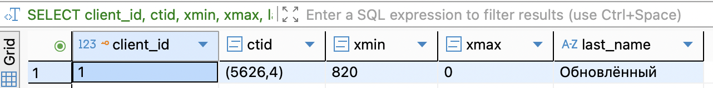

- `ctid` изменился (новая версия записана в другое место на странице или на новой странице)
- `xmin`  сменился на ID транзакции, выполнившей `UPDATE`
- `xmax` останется `0` (это живая версия)

**извлекаем t_infomask**
```
SELECT ctid FROM clients WHERE client_id = 1; 
SELECT 
    t_ctid,
    t_xmin,
    t_xmax,
    t_infomask,
    t_infomask::bit(16) AS infomask_bits,
    t_infomask2
FROM heap_page_items(get_raw_page('clients', 5626))
WHERE t_ctid IS NOT NULL
ORDER BY t_ctid;
```
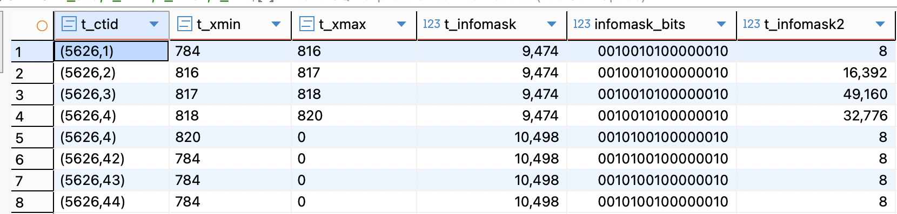

**значения t_infomask****
- 9,474 (0010010100000010) - для обновленных/удаленных версий
- 10,498 (0010100100000010) - для актуальных версий
```
SELECT 
    t_ctid,
    t_xmin AS inserting_transaction,
    t_xmax AS deleting_transaction,
    CASE 
        WHEN t_xmax = 0 THEN 'LIVE (current version)'
        ELSE 'DEAD (old version)'
    END AS version_status
FROM heap_page_items(get_raw_page('clients', 5626))
WHERE t_ctid IS NOT NULL
ORDER BY t_ctid;
```
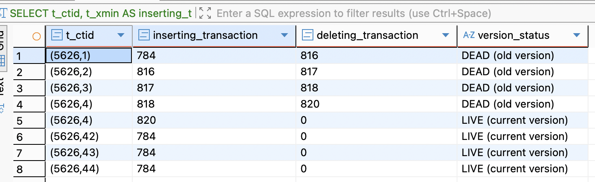

## 2)в транзакции 

**откат транзации:**
```
-- запоминаем исходное состояние
SELECT ctid, xmin, xmax, last_name 
FROM clients WHERE client_id = 2;

BEGIN;
SELECT txid_current() AS rollback_txid;

-- обновляем
UPDATE clients 
SET last_name = 'Временная_Фамилия' 
WHERE client_id = 2;

-- смотрим внутри транзакции
SELECT ctid, xmin, xmax, last_name 
FROM clients WHERE client_id = 2;

-- откатываб
ROLLBACK;

-- проверяем, что всё вернулось
SELECT ctid, xmin, xmax, last_name 
FROM clients WHERE client_id = 2;
```
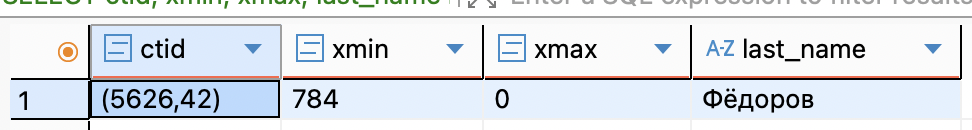
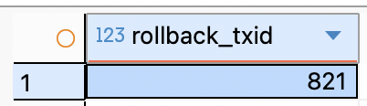
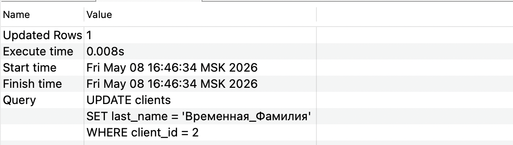
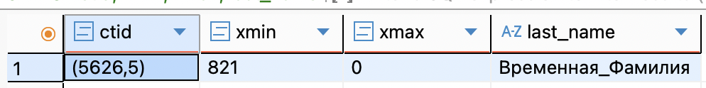
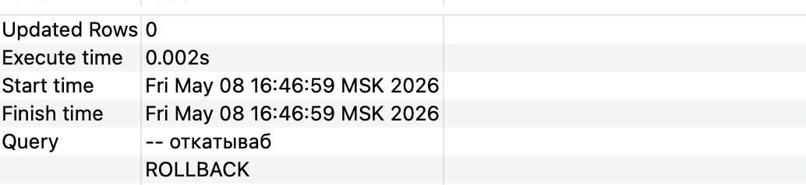
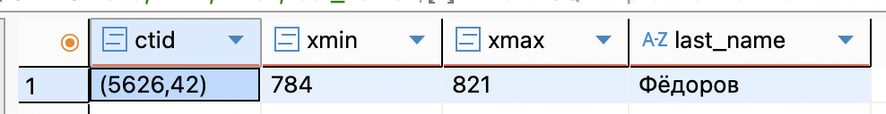
## 3)дедлок
T1
```
SET search_path TO bakery_db;
BEGIN;

UPDATE clients SET last_name = 'Session1' WHERE client_id = 1;
SELECT ctid, xmin, xmax FROM clients WHERE client_id = 1;
```
T2
```
SET search_path TO bakery_db;
BEGIN;

UPDATE clients SET last_name = 'Session2' WHERE client_id = 2;
SELECT ctid, xmin, xmax FROM clients WHERE client_id = 2;

UPDATE clients SET last_name = 'Session2_Again' WHERE client_id = 1;

```
T1
```
UPDATE clients SET last_name = 'Session1_Again' WHERE client_id = 2;
```
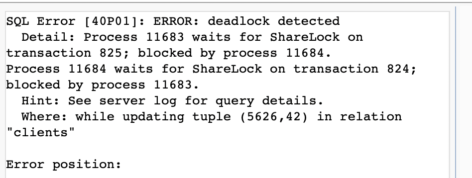
 1. T1 блокирует `client_id = 1`
2. Т2 блокирует `client_id = 2`
3. Т2 ждёт, пока Т1 освободит `client_id = 1`
4. Т1 пытается заблокировать `client_id = 2` → DEADLOCK
PostgreSQL обнаружит дедлок и откатит одну из транзакций
## 4)явная блокировка
**1.жесткая блокировка**
- этот режим запрещает любые изменения (UPDATE/DELETE) и другие эксклюзивные блокировки (SELECT ... FOR UPDATE).
**T1**
```
SET search_path TO bakery_db;
BEGIN;

SELECT client_id, last_name, phone_number
FROM clients
WHERE client_id = 1
FOR UPDATE;

SELECT txid_current() AS my_txid;
```
транзакция не завершается (нет commit), блокировка держится
**Т2**
```
SET search_path TO bakery_db;
BEGIN;

-- пытаемся обновить эту же строку
UPDATE clients 
SET phone_number = '999-000' 
WHERE client_id = 1;
```
результат: сессия 2 зависнет (ожидает), пока сессия 1 не сделает commit


2.FOR NO KEY UPDATE
**T1**
```
SET search_path TO bakery_db;
BEGIN;

--- обновляем обычный столбец(не id)
UPDATE clients SET last_name = 'Test' WHERE client_id = 3;
```
**T2**
```
SET search_path TO bakery_db;
BEGIN;

SELECT client_id, last_name ---ту же строку обновления
FROM clients 
WHERE client_id = 3 
FOR NO KEY UPDATE;
```
результат - зависание