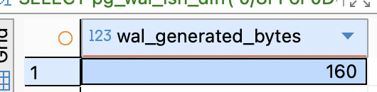
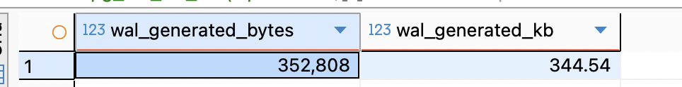
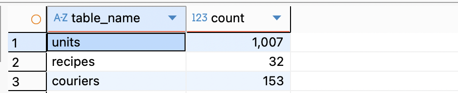
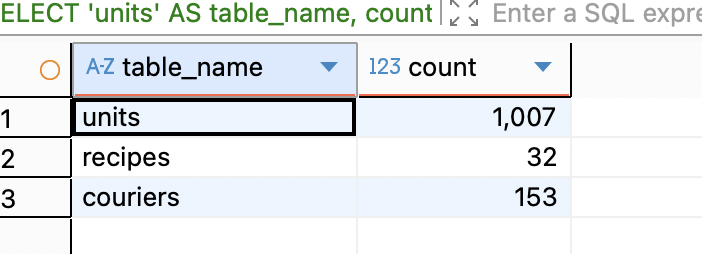

запускаем контейнер и бд:
```
docker compose -f s2/hw1/docker/docker-compose.yml up -d
```
#### 1)сравнение LSN до и после `INSERT`
```
SELECT pg_current_wal_lsn() AS lsn_before;

INSERT INTO bakery_db.units (unit_name, description)
VALUES ('тст_2a', 'тест для задания 2a')
ON CONFLICT (unit_name) DO NOTHING;

SELECT pg_current_wal_lsn() AS lsn_after;

SELECT pg_wal_lsn_diff('0/8FF6F0D0', '0/8FF6F030') AS wal_generated_bytes;
```



**итог:** операция сгенерировала 160 байтов WAL-журнала.

#### 2)сравнение WAL до и после COMMIT
WAL-записи генерируются сразу при изменении данных, но на диск физически сбрасываются только при COMMIT

фиксируем до начала транзации:
```
SELECT pg_current_wal_lsn() AS lsn_before;
```


начинаем транзакцию и меняем данные
```
INSERT INTO units (unit_name, description)
VALUES ('тест', 'проверка COMMIT')
ON CONFLICT (unit_name) DO NOTHING;
```

cмотрим LSN внутри транзакции ( до COMMIT):
```
SELECT pg_current_wal_lsn() AS lsn_do_commita;
```


после коммита:
```
COMMIT;
SELECT pg_current_wal_lsn() AS lsn_after_commit;
```


**расчет разницы:**
сколько WAL сгенерировал INSERT (в байтах)
```
SELECT pg_wal_lsn_diff('0/8FF70148', '0/8FF6FC20') AS wal_generated_bytes;
```

cколько WAL записано на диск после COMMIT
```
SELECT pg_wal_lsn_diff('0/8FF701A8', '0/8FF6FC20') AS wal_flushed_bytes;
```

 коммит добавил 96 байт - это служебная запись о фиксации транзакции
#### 2) массовая вставка
фиксируем LSN до массовой вставки:
```
SET search_path TO bakery_db;
SELECT pg_current_wal_lsn() AS lsn_before_bulk;
```


делаем массовую вставку:
```
INSERT INTO units (unit_name, description)
SELECT 
  'булка_' || i, 
  'Тестовая единица №' || i
FROM generate_series(1, 1000) AS i
ON CONFLICT (unit_name) DO NOTHING;
```

фиксируем LSN после вставки
```
SELECT pg_current_wal_lsn() AS lsn_after_bulk;
```


расчет:
```
SELECT 
  pg_wal_lsn_diff('0/8FFC64B8', '0/8FF70290') AS wal_generated_bytes,
  round(pg_wal_lsn_diff('0/8FFC64B8', '0/8FF70290') / 1024.0, 2) AS wal_generated_kb;
```


#### 3) дампы
###### дамп только структуры базы (без данных)
```
pg_dump -U app_user -d bakery_db --schema-only > bakery_schema_only.sql
```
результат в bakery_schema_only.sql

###### дамп одной таблицы (структура + данные)
```
pg_dump -U app_user -d bakery_db --table=orders > bakery_orders.sql
```
результат в bakery_orders.sql

###### на новую бд
```
createdb -U postgres bakery_db_test
psql -U app_user -d bakery_db_test -f bakery_schema_only.sql

createdb -U postgres bakery_db_orders_test
psql -U app_user -d bakery_db_orders_test -f bakery_orders.sql
```
проверка подключения:
```
psql -U app_user -d bakery_db_test
psql -U app_user -d bakery_db_orders_test
SELECT count(*) FROM orders;
```


#### 4)Seed-скрипты и проверка идемпотентности
создала файл `seed_test_data.sql`  с идемпотентными вставками данных
```
SET search_path TO bakery_db;

INSERT INTO units (unit_name, description) VALUES
  ('кг', 'килограммы'),
  ('л', 'литры')
ON CONFLICT (unit_name) DO NOTHING;

INSERT INTO recipes (description, allergens)
SELECT 'Бородинский хлеб', ARRAY['мука ржаная', 'солод', 'кориандр']
WHERE NOT EXISTS (SELECT 1 FROM recipes WHERE description = 'Бородинский хлеб');

INSERT INTO couriers (phone_number, last_name, first_name, middle_name)
SELECT '+7(999)000-00-01', 'Смирнов', 'Алексей', 'Петрович'
WHERE NOT EXISTS (SELECT 1 FROM couriers WHERE phone_number = '+7(999)000-00-01');
```
запускаем првый раз и выполняем запрос

запускаем второй раз

итог - идемпотентый сид