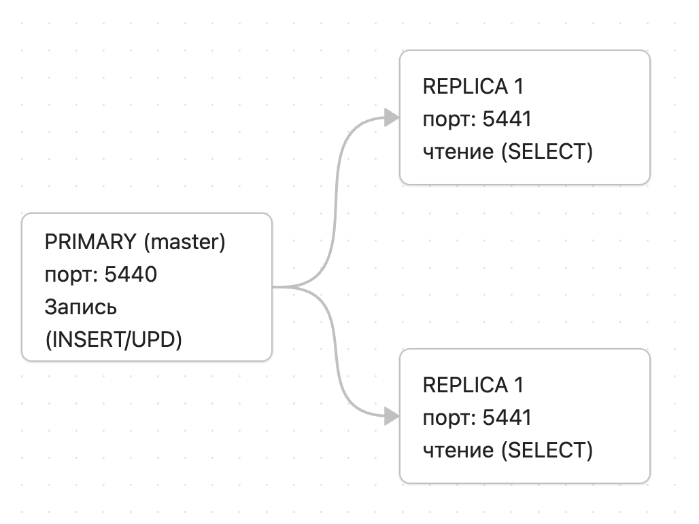
1. Primary (5440): Принимает все запросы на запись. Все изменения сначала пишутся в WAL (журнал предзаписи).
2. WAL Stream: Primary непрерывно отправляет поток WAL-записей подключенным репликам.
3. Replica 1 & 2 (5441, 5442): Получают WAL, применяют изменения у себя и становятся доступными для чтения (`SELECT`). Вставку данных на них делать нельзя (Read-Only).

## 1. физическая репликация 
docker-compose.yml
```
services:
  primary:
    image: postgres:15-alpine
    container_name: pg_primary
    environment:
      POSTGRES_USER: admin
      POSTGRES_PASSWORD: admin123
      POSTGRES_DB: bakery_db
    ports:
      - "5440:5432"
    volumes:
      - ./primary_data:/var/lib/postgresql/data
    command: >
      postgres
      -c wal_level=replica
      -c max_wal_senders=10
      -c max_replication_slots=10
      -c listen_addresses='*'

  replica1:
    image: postgres:15-alpine
    container_name: pg_replica1
    environment:
      POSTGRES_USER: admin
      POSTGRES_PASSWORD: admin123
      POSTGRES_DB: bakery_db
    ports:
      - "5441:5432"
    volumes:
      - ./replica1_data:/var/lib/postgresql/data
    depends_on:
      - primary

  replica2:
    image: postgres:15-alpine
    container_name: pg_replica2
    environment:
      POSTGRES_USER: admin
      POSTGRES_PASSWORD: admin123
      POSTGRES_DB: bakery_db
    ports:
      - "5442:5432"
    volumes:
      - ./replica2_data:/var/lib/postgresql/data
    depends_on:
      - primary
```


#### **запускаем primary:**
```
docker compose up -d primary
```
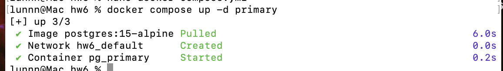

- **настраиваем pg_hba.conf**
разрешаем репликационные подключения для будущего пользователя:
```
docker exec -it pg_primary bash -c "echo 'host replication replicator 0.0.0.0/0 md5' >> /var/lib/postgresql/data/pg_hba.conf"
docker restart pg_primary
```
проверка:
```
docker compose ps primary
docker exec -it pg_primary psql -U admin -d bakery_db -c "SHOW wal_level; SHOW max_wal_senders; SHOW max_replication_slots;"
```
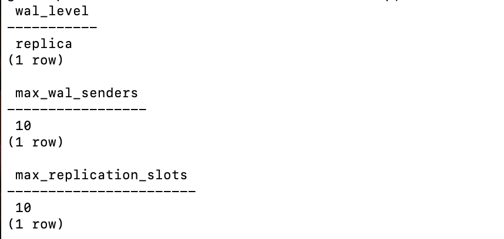


-  **снимок для реплику 1**
```
docker exec -it pg_primary pg_basebackup -h localhost -U replicator -D /tmp/rep1 -Fp -Xs -P -R
```

копируем данные на хост в подготовленную папку и чистим временные файлы:
```
docker cp pg_primary:/tmp/rep1/. ./replica1_data/
docker exec pg_primary rm -rf /tmp/rep1
```
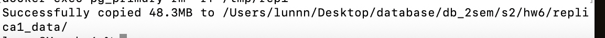

- **снимок для реплики 2**
```
docker exec -it pg_primary pg_basebackup -h localhost -U replicator -D /tmp/rep2 -Fp -Xs -P -R
```
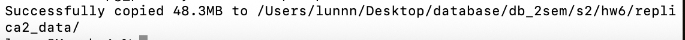

#### **запускаем реплики:**
```
docker compose up -d replica1 replica2
docker compose ps
```
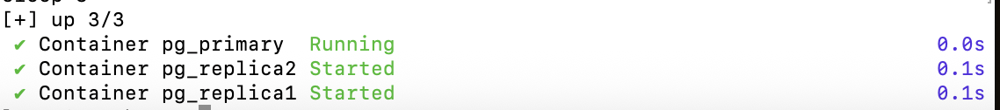
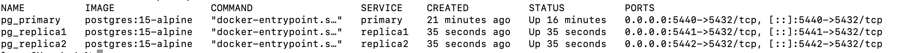
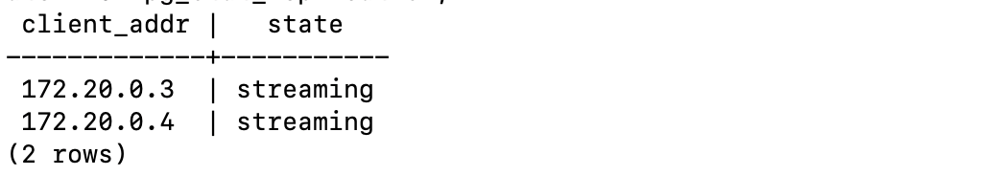
проверка репликации данных:
- **вставляем данные на Master (Primary)**
```
CREATE TABLE IF NOT EXISTS test_rep (
    id SERIAL PRIMARY KEY, 
    message TEXT, 
    created_at TIMESTAMP DEFAULT NOW()
)
INSERT INTO test_rep (message) VALUES ('Данные с мастера')
```

#### **проверяем наличие строки на репликах**:
```
docker exec -it pg_replica1 psql -U admin -d bakery_db -c "SELECT * FROM hw6_test;"
docker exec -it pg_replica2 psql -U admin -d bakery_db -c "SELECT * FROM hw6_test;"
```
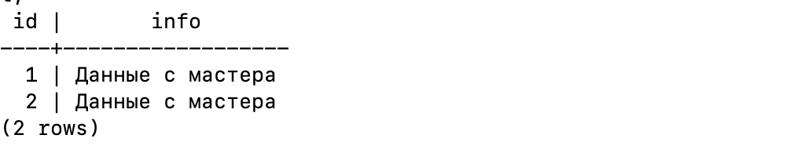

```
docker exec -it pg_replica1 psql -U admin -d bakery_db -c "INSERT INTO hw6_test (info) VALUES ('пробуем вставить');"
docker exec -it pg_replica2 psql -U admin -d bakery_db -c "INSERT INTO hw6_test (info) VALUES ('пробуем вставить');"
```


#### анализ Replication Lag
- вставим 1 000 000 строк в нашу таблицу. 
```
docker exec -it pg_primary psql -U admin -d bakery_db -c "
INSERT INTO hw6_test (info) 
SELECT 'load_test_' || generate_series(1, 1000000);
"
```

- наблюдаем за lag, сразу после и после того как подождал
```
docker exec -it pg_primary psql -U admin -d bakery_db -c "
SELECT 
    client_addr,
    state,
    sent_lsn,
    replay_lsn,
    pg_wal_lsn_diff(sent_lsn, replay_lsn) AS lag_bytes
FROM pg_stat_replication;
"
```
- вставим **1 000 000 строк** в нашу таблицу. Это создаст объемный поток WAL, который реплике нужно будет обработать

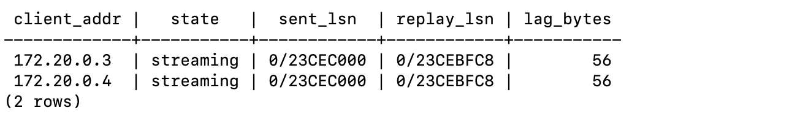
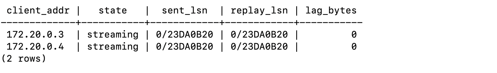
## 2. логическая репликация
- добавляем в docker-compose.yml
```
  logical_primary:
    image: postgres:15-alpine
    container_name: pg_logical_primary
    environment:
      POSTGRES_USER: admin
      POSTGRES_PASSWORD: admin123
      POSTGRES_DB: bakery_db
    ports:
      - "5443:5432"
    volumes:
      - ./logical_primary:/var/lib/postgresql/data
    command: >
      postgres
      -c wal_level=logical
      -c max_wal_senders=10
      -c max_replication_slots=10
      -c listen_addresses='*'

  logical_replica:
    image: postgres:15-alpine
    container_name: pg_logical_replica
    environment:
      POSTGRES_USER: admin
      POSTGRES_PASSWORD: admin123
      POSTGRES_DB: bakery_db
    ports:
      - "5444:5432"
    volumes:
      - ./logical_replica:/var/lib/postgresql/data
    depends_on:
      - logical_primary
    command: >
      postgres
      -c listen_addresses='*'
```

- запускаем:
```
docker compose up -d logical_primary logical_replica
```

#### настройка издателя на мастере (Logical Primary, порт 5443)
самое важное правило логической репликации: таблица обязана иметь PRIMARY KEY, без него PostgreSQL не сможет идентифицировать строки для обновлений
- **создаем таблицу, данные и публикацию:**
```
docker exec -it pg_logical_primary psql -U admin -d bakery_db -c "
CREATE TABLE logical_products (
    id SERIAL PRIMARY KEY,
    product_name TEXT
);

INSERT INTO logical_products (product_name) VALUES ('Батон');
CREATE PUBLICATION logical_pub FOR TABLE logical_products;
"
```


#### настройка подписчика (Replica, порт 5444)
 она не переносит структуру таблиц автоматически, на подписчике нужно вручную создать таблицу с точно такой же схемой
```
docker exec -it pg_logical_replica psql -U admin -d bakery_db -c "
CREATE TABLE logical_products (
    id SERIAL PRIMARY KEY,
    product_name TEXT
);

CREATE SUBSCRIPTION logical_sub
CONNECTION 'host=pg_logical_primary port=5432 dbname=bakery_db user=admin password=admin123'
PUBLICATION logical_pub;
"
```

проверим, что данные реплицируются
```
docker exec -it pg_logical_replica psql -U admin -d bakery_db -c "SELECT * FROM logical_products;"
```
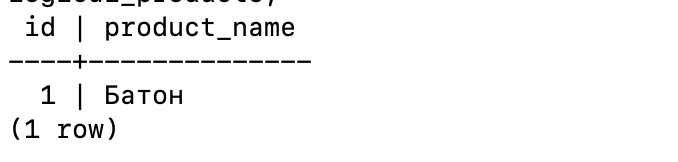

#### показать, что DDL (изменения структуры) НЕ реплицируются
- изменим таблицу на мастере
```
docker exec -it pg_logical_primary psql -U admin -d bakery_db -c 
"ALTER TABLE logical_products ADD COLUMN price NUMERIC(10,2);"
```

- проверим таблицу на реплике
```
docker exec -it pg_logical_replica psql -U admin -d bakery_db -c "\d logical_products"
```
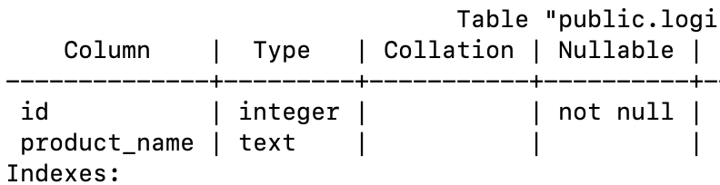
результат: колонка price не появилась на реплике

#### проверка REPLICA IDENTITY
логическая репликация по умолчанию требует PRIMARY KEY в таблице, чтобы точно знать, какую строку обновлять или удалять. 
- создаем таблицу БЕЗ PRIMARY KEY на Мастере (порт 5443)
```
"CREATE TABLE no_pk_table (id INT, name TEXT);"
```
- добавляяем ее в публикацию
```
"ALTER PUBLICATION logical_pub ADD TABLE no_pk_table;"
```
- вставляем данные на Мастере
```
"INSERT INTO no_pk_table VALUES (1, 'Test');"
```
- cоздаем такую же структуру на Реплике (порт 5444)
```
"CREATE TABLE no_pk_table (id INT, name TEXT);"
```
- обновляем мастер и проверяем реплику
```
docker exec -it pg_logical_primary psql -U admin -d bakery_db -c "UPDATE no_pk_table SET name = 'Updated_Test' WHERE id = 1;"
docker exec -it pg_logical_replica psql -U admin -d bakery_db -c "SELECT * FROM no_pk_table;"
```

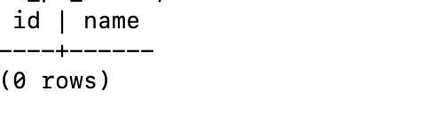
результат: изменений на реплике нету

#### проверка статуса репликации
- проверка статуса подписки на Реплике
```
docker exec -it pg_logical_replica psql -U admin -d bakery_db -c "
SELECT 
    subname, 
    pid, 
    received_lsn, 
    latest_end_lsn, 
    latest_end_time 
FROM pg_stat_subscription;
"
```
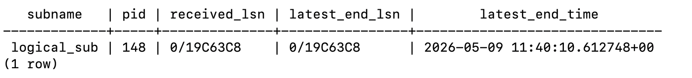

#### pg_dump для логической репликации
так как DDL не синхронизируется, pg_dump используется для ручной инициализации схемы
на новом подписчике или после изменений структуры на мастере.

--schema-only выгружает только CREATE TABLE/INDEX, без данных (данные придут через репликацию)
```
docker exec pg_logical_primary pg_dump -U admin -d bakery_db --schema-only -t logical_products > schema.sql
docker exec -i pg_logical_replica psql -U admin -d bakery_db < schema.sql
```
после применения схемы подписка автоматически догонит данные.