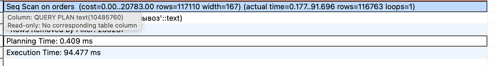
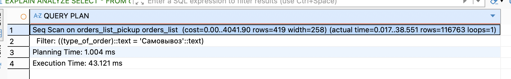
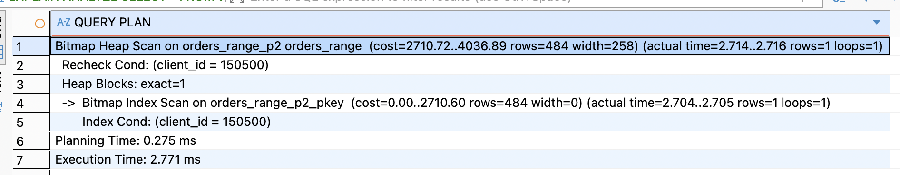
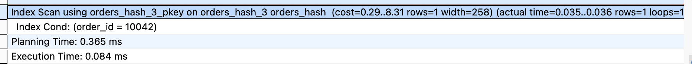
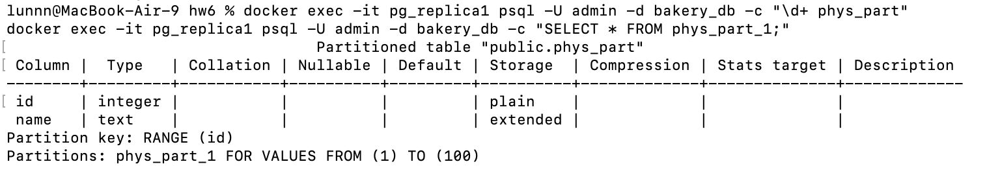
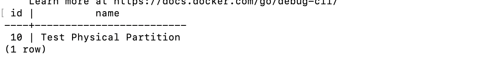
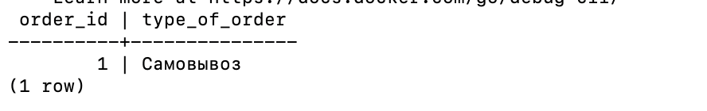
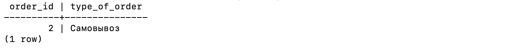
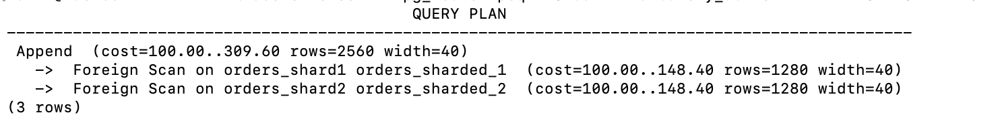
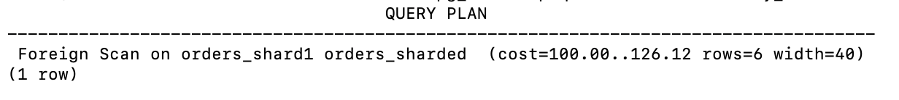

### 1.Секционирование: RANGE / LIST / HASH
##### 1)Секционирование по списку (LIST)
2. Создаем родительскую таблицу
```
CREATE TABLE orders_list (LIKE orders INCLUDING DEFAULTS) PARTITION BY LIST (type_of_order);

ALTER TABLE orders_list ADD PRIMARY KEY (order_id, type_of_order);
```

2. Создаем секции
```
CREATE TABLE orders_list_pickup PARTITION OF orders_list FOR VALUES IN ('Самовывоз');
CREATE TABLE orders_list_delivery PARTITION OF orders_list FOR VALUES IN ('Доставка', 'Курьер');
```

3. Копируем данные
```
INSERT INTO orders_list SELECT * FROM orders;
```

ЗАПРОС ДЛЯ ПРОВЕРКИ:

```
EXPLAIN ANALYZE SELECT * FROM orders WHERE type_of_order = 'Самовывоз';
EXPLAIN ANALYZE SELECT * FROM orders_list WHERE type_of_order = 'Самовывоз';
```

итог: в два раза быстрее, тк планировщик запросов отсек секцию доставок (`orders_list_delivery`) и пошел искать данные **исключительно** в физической таблице `orders_list_pickup`

##### 2)Секционирование по диапазонам (RANGE)
Разделим заказы по диапазону client_id (батчами по 100 000 клиентов)
```
CREATE TABLE orders_range (LIKE orders INCLUDING DEFAULTS) PARTITION BY RANGE (client_id);

ALTER TABLE orders_range ADD PRIMARY KEY (order_id, client_id);
CREATE TABLE orders_range_p1 PARTITION OF orders_range FOR VALUES FROM (1) TO (100000);
CREATE TABLE orders_range_p2 PARTITION OF orders_range FOR VALUES FROM (100000) TO (200000);
CREATE TABLE orders_range_p3 PARTITION OF orders_range FOR VALUES FROM (200000) TO (300000);

INSERT INTO orders_range SELECT * FROM orders;
EXPLAIN ANALYZE SELECT * FROM orders_range WHERE client_id = 150500;
```

мы видим, что запрос пошел строго в таблицу orders_range_p2

##### 3)Секционирование по хешу (HASH)

```
CREATE TABLE orders_hash (LIKE orders INCLUDING DEFAULTS) PARTITION BY HASH (order_id);
ALTER TABLE orders_hash ADD PRIMARY KEY (order_id);

CREATE TABLE orders_hash_0 PARTITION OF orders_hash FOR VALUES WITH (MODULUS 4, REMAINDER 0);

CREATE TABLE orders_hash_1 PARTITION OF orders_hash FOR VALUES WITH (MODULUS 4, REMAINDER 1);

CREATE TABLE orders_hash_2 PARTITION OF orders_hash FOR VALUES WITH (MODULUS 4, REMAINDER 2);

CREATE TABLE orders_hash_3 PARTITION OF orders_hash FOR VALUES WITH (MODULUS 4, REMAINDER 3);

INSERT INTO orders_hash SELECT * FROM orders;
EXPLAIN ANALYZE SELECT * FROM orders_hash WHERE order_id = 10042;
```

планировщик вычислил хеш-значение для order_id = 10042, применил деление по модулю 4 и в итоге отсек три лишние секции и обратился исключительно к таблице orders_hash_3

### 2. Секционирование и физическая репликация
##### 1) Проверить, что секционирование есть на репликах

- cоздаем секционированную таблицу и одну секцию на **Мастере** (pg_primary), и добавляем туда строку:
```
docker exec -it pg_primary psql -U admin -d bakery_db -c "
CREATE TABLE phys_part (id INT, name TEXT) PARTITION BY RANGE(id);
CREATE TABLE phys_part_1 PARTITION OF phys_part FOR VALUES FROM (1) TO (100);
INSERT INTO phys_part VALUES (10, 'Test Physical Partition');
"
```

- теперь идем на **Реплику 1** (pg_replica1) и проверяем структуру таблицы и наличие данных:
```
docker exec -it pg_replica1 psql -U admin -d bakery_db -c "\d+ phys_part"
docker exec -it pg_replica1 psql -U admin -d bakery_db -c "SELECT * FROM phys_part_1;"
```

секционирование на реплике применилось и работает, но применилось оно не потому, что реплика сама распределяла строки по секциям, а потому, что физическая репликация побайтово скопировала уже разделенные мастером файлы данных
### 3. Логическая репликация и секционирование publish_via_partition_root = on / off

#### 1)проверка режима publish_via_partition_root = off 
В данном случае команды INSERT, UPDATE, DELETE приходят на подписчиков с названием той конкретной секции, к которой относилась эта строка. Для этого на подписчике должны быть созданы соответствующие таблицы
- **на Мастере** создаем секционированную таблицу, секцию и публикацию с флагом `off`
```
docker exec -it pg_logical_primary psql -U admin -d bakery_db -c "
CREATE TABLE orders_root_off (
    order_id INT, 
    type_of_order TEXT, 
    PRIMARY KEY (order_id, type_of_order)
) PARTITION BY LIST(type_of_order);

CREATE TABLE orders_off_pickup PARTITION OF orders_root_off FOR VALUES IN ('Самовывоз');
CREATE PUBLICATION pub_root_off FOR TABLE orders_root_off WITH (publish_via_partition_root = off);
"
```

- **на Реплике:**
```
docker exec -it pg_logical_replica psql -U admin -d bakery_db -c "
CREATE TABLE orders_off_pickup (
    order_id INT, 
    type_of_order TEXT, 
    PRIMARY KEY (order_id, type_of_order)
);

CREATE SUBSCRIPTION sub_root_off CONNECTION 'host=pg_logical_primary port=5432 dbname=bakery_db user=admin password=admin123' PUBLICATION pub_root_off;
"
```

- **тестируем вставку**
```
docker exec -it pg_logical_primary psql -U admin -d bakery_db -c "INSERT INTO orders_root_off VALUES (1, 'Самовывоз');"
docker exec -it pg_logical_replica psql -U admin -d bakery_db -c "SELECT * FROM orders_off_pickup;"
```

- **строка успешно реплицировалась в изолированную таблицу orders_off_pickup**

#### 2)Проверка режима publish_via_partition_root = on
Когда опция включена, при репликации данных все изменения передаются через основную (родительскую) таблицу, а не через её отдельные партиции

- **на Мастере** создаем новую структуру и публикацию с флагом `on`:
```
docker exec -it pg_logical_primary psql -U admin -d bakery_db -c "
CREATE TABLE orders_root_on (
    order_id INT, 
    type_of_order TEXT, 
    PRIMARY KEY (order_id, type_of_order)
) PARTITION BY LIST(type_of_order);

CREATE TABLE orders_on_pickup PARTITION OF orders_root_on FOR VALUES IN ('Самовывоз');
CREATE PUBLICATION pub_root_on FOR TABLE orders_root_on WITH (publish_via_partition_root = on);
"
```
**на реплике:**
```
CREATE SUBSCRIPTION sub_root_on CONNECTION 'host=pg_logical_primary port=5432 dbname=bakery_db user=admin password=admin123' PUBLICATION pub_root_on; "
```


### 4. Шардирование через
##### 1
- добавление шардов в docker-compose.yml
```
pg_shard1:
    image: postgres:15-alpine
    container_name: pg_shard1
    environment:
      POSTGRES_USER: admin
      POSTGRES_PASSWORD: admin123
      POSTGRES_DB: bakery_db
    ports:
      - "5445:5432"
    volumes:
      - ./shard1_data:/var/lib/postgresql/data

  pg_shard2:
    image: postgres:15-alpine
    container_name: pg_shard2
    environment:
      POSTGRES_USER: admin
      POSTGRES_PASSWORD: admin123
      POSTGRES_DB: bakery_db
    ports:
      - "5446:5432"
    volumes:
      - ./shard2_data:/var/lib/postgresql/data

  pg_router:
    image: postgres:15-alpine
    container_name: pg_router
    environment:
      POSTGRES_USER: admin
      POSTGRES_PASSWORD: admin123
      POSTGRES_DB: bakery_db
    ports:
      - "5447:5432"
    volumes:
      - ./router_data:/var/lib/postgresql/data
    depends_on:
      - pg_shard1
      - pg_shard2
```

- на первом шарде (pg_shard1):
```
docker exec -it pg_shard1 psql -U admin -d bakery_db -c "
CREATE TABLE orders (
    order_id INT PRIMARY KEY,
    client_id INT NOT NULL,
    type_of_order TEXT
);
INSERT INTO orders VALUES (1, 50, 'Самовывоз');
"
```

- на втором шарде(pq_shard2)
```
docker exec -it pg_shard2 psql -U admin -d bakery_db -c "
CREATE TABLE orders (
    order_id INT PRIMARY KEY,
    client_id INT NOT NULL,
    type_of_order TEXT
);
INSERT INTO orders VALUES (2, 150, 'Доставка');
"
```

- настраиваем роутер
```
docker exec -it pg_router psql -U admin -d bakery_db -c "
-- 1. Подключаем расширение для работы с внешними серверами
CREATE EXTENSION IF NOT EXISTS postgres_fdw;

-- 2. Регистрируем удаленные сервера (по именам наших docker-контейнеров)
CREATE SERVER shard1_server FOREIGN DATA WRAPPER postgres_fdw OPTIONS (host 'pg_shard1', port '5432', dbname 'bakery_db');
CREATE SERVER shard2_server FOREIGN DATA WRAPPER postgres_fdw OPTIONS (host 'pg_shard2', port '5432', dbname 'bakery_db');

-- 3. Связываем пользователя роутера с пользователями на шардах
CREATE USER MAPPING FOR admin SERVER shard1_server OPTIONS (user 'admin', password 'admin123');
CREATE USER MAPPING FOR admin SERVER shard2_server OPTIONS (user 'admin', password 'admin123');

-- 4. Создаем виртуальную родительскую таблицу на роутере
CREATE TABLE orders_sharded (
    order_id INT NOT NULL,
    client_id INT NOT NULL,
    type_of_order TEXT
) PARTITION BY RANGE (client_id);

-- 5. Подключаем удаленные таблицы как партиции
CREATE FOREIGN TABLE orders_shard1 PARTITION OF orders_sharded 
    FOR VALUES FROM (1) TO (100) 
    SERVER shard1_server OPTIONS (schema_name 'public', table_name 'orders');

CREATE FOREIGN TABLE orders_shard2 PARTITION OF orders_sharded 
    FOR VALUES FROM (100) TO (200) 
    SERVER shard2_server OPTIONS (schema_name 'public', table_name 'orders');
"
```

проверяем:
```
docker exec -it pg_router psql -U admin -d bakery_db -c 
"EXPLAIN SELECT * FROM orders_sharded;"
```

один узел Append и два узла сканирования Foreign Scan

```
docker exec -it pg_router psql -U admin -d bakery_db -c 
"EXPLAIN SELECT * FROM orders_sharded WHERE client_id = 50;"
```

запрос на конкретный шард, поэтому один Foreign Scan