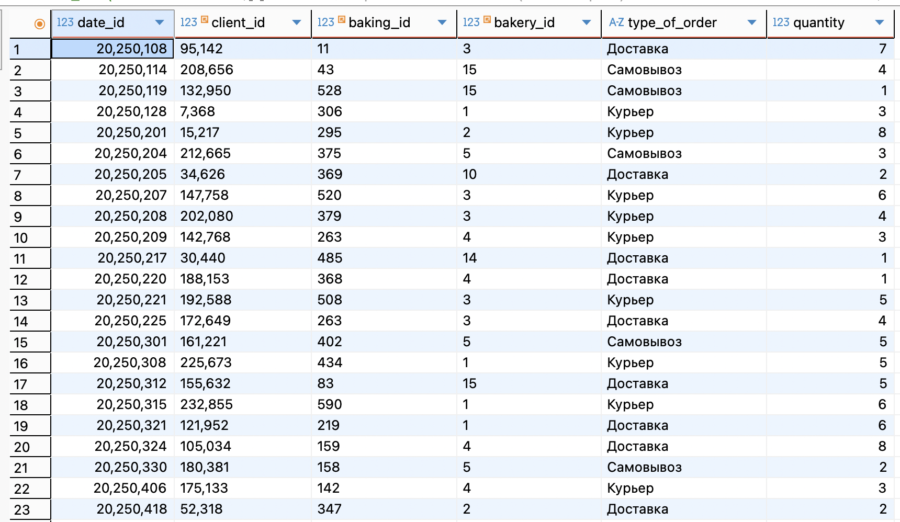
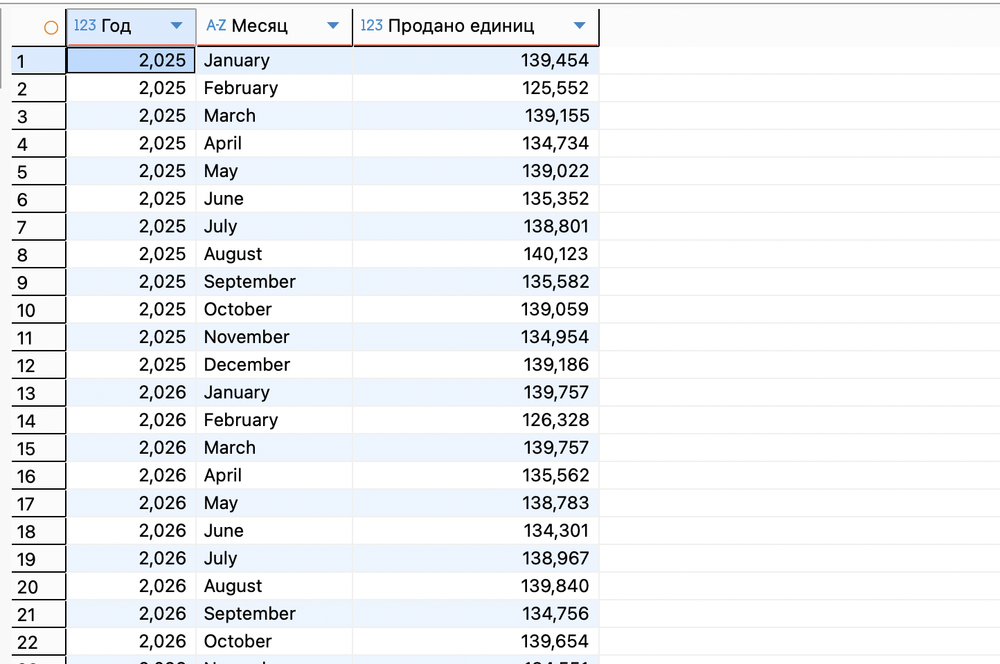
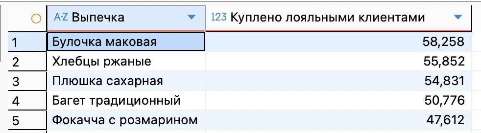
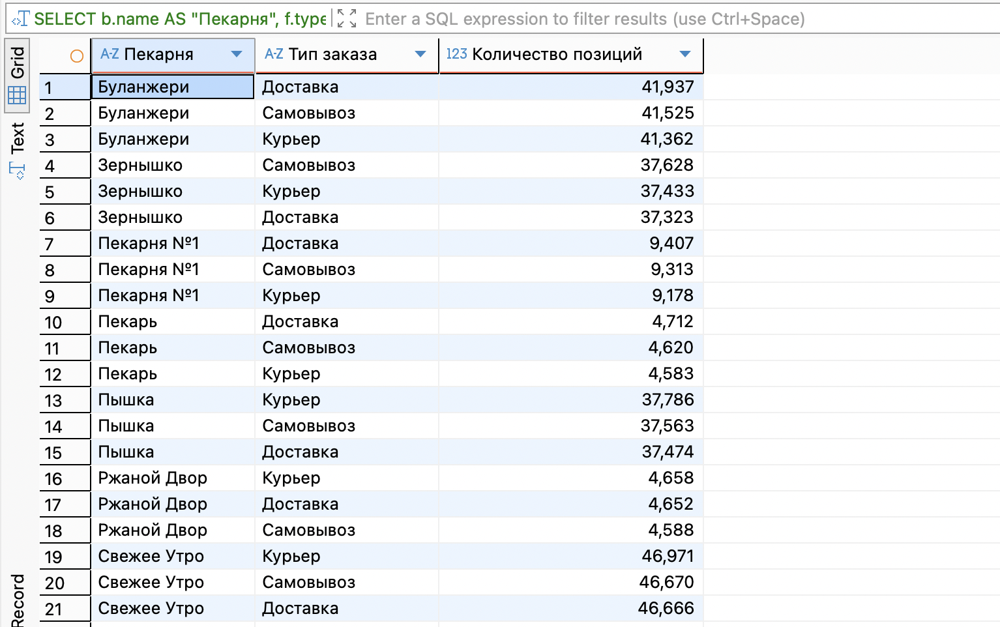

### 1. Аналитические вопросы по проекту
для анализа работы сети пекарен ответим на следующие вопросы:
1. Какова динамика объема продаж (в количестве проданных позиций) по месяцам?
2. Какая выпечка является самой популярной среди клиентов с высоким уровнем лояльности? 
3. Из каких пекарен чаще всего оформляют доставку (в сравнении с самовывозом)?

Для нашей OLAP-системы главным фактом будут **продажи конкретных позиций выпечки**. Назовем таблицу фактов: fact_sales (или `fact_order_items`)

**1 строка = одна проданная позиция выпечки в рамках одного заказа.** (позволяет группировать данные и по целым заказам, и по отдельным круассанам/батонам)

создадим новую схему olap и подготовим денормализованные таблицы
```
CREATE SCHEMA IF NOT EXISTS olap;

-- 1. Измерение: Дата (dim_date)
CREATE TABLE olap.dim_date (
    date_id INT PRIMARY KEY,
    full_date DATE,
    year INT,
    month INT,
    month_name TEXT
);

-- 2. Измерение: Клиент (dim_client)
CREATE TABLE olap.dim_client (
    client_id INT PRIMARY KEY,
    full_name TEXT,
    loyalty_level INT
);

-- 3. Измерение: Продукт (dim_product) - собираем данные о выпечке
CREATE TABLE olap.dim_product (
    baking_id INT PRIMARY KEY,
    name VARCHAR(100),
    is_hit BOOLEAN -- cделаем флаг, есть ли тег 'хит'
);

-- 4. Измерение: Пекарня (dim_bakery)
CREATE TABLE olap.dim_bakery (
    bakery_id INT PRIMARY KEY,
    name VARCHAR(100)
);

-- 5. Таблица фактов (fact_sales)
CREATE TABLE olap.fact_sales (
    fact_id SERIAL PRIMARY KEY,
    date_id INT REFERENCES olap.dim_date(date_id),
    client_id INT REFERENCES olap.dim_client(client_id),
    baking_id INT REFERENCES olap.dim_product(baking_id),
    bakery_id INT REFERENCES olap.dim_bakery(bakery_id),
    type_of_order VARCHAR(50),
    quantity NUMERIC(10,2)
);
```

Заполнение OLAP-таблиц из OLTP (ETL-процесс)
```
-- Шаг 1: Заполняем календарь (dim_date) на 2 года
INSERT INTO olap.dim_date (date_id, full_date, year, month, month_name)
SELECT 
    to_char(d, 'YYYYMMDD')::INT, 
    d, 
    EXTRACT(YEAR FROM d), 
    EXTRACT(MONTH FROM d), 
    to_char(d, 'TMMonth')
FROM generate_series('2025-01-01'::DATE, '2026-12-31'::DATE, '1 day'::interval) d;

-- Шаг 2: Заполняем клиентов (dim_client)
INSERT INTO olap.dim_client (client_id, full_name, loyalty_level)
SELECT 
    client_id, 
    last_name || ' ' || first_name, 
    (preferences->>'loyalty')::INT
FROM bakery_db.clients;

-- Шаг 3: Заполняем продукты (dim_product)
INSERT INTO olap.dim_product (baking_id, name, is_hit)
SELECT 
    baking_id, 
    name, 
    'хит' = ANY(tags)
FROM bakery_db.baking_goods;

-- Шаг 4: Заполняем пекарни (dim_bakery)
INSERT INTO olap.dim_bakery (bakery_id, name)
SELECT bakery_id, name FROM bakery_db.bakeries;

-- Шаг 5: Заполняем ФАКТЫ (fact_sales)
INSERT INTO olap.fact_sales (date_id, client_id, baking_id, bakery_id, type_of_order, quantity)
SELECT 
    to_char('2025-01-01'::DATE + (o.order_id % 700), 'YYYYMMDD')::INT AS date_id,
    o.client_id,
    obg.baking_id,
    o.bakery_id,
    o.type_of_order,
    obg.quantity
FROM bakery_db.orders o
JOIN bakery_db.order_baking_goods obg ON o.order_id = obg.order_id;
```



Запрос 1. Динамика продаж по месяцам (в единицах продукции)
```
SELECT 
    d.year AS "Год", 
    d.month_name AS "Месяц", 
    SUM(f.quantity) AS "Продано единиц"
FROM olap.fact_sales f
JOIN olap.dim_date d ON f.date_id = d.date_id
GROUP BY d.year, d.month, d.month_name
ORDER BY d.year, d.month;
```


Запрос 2. Топ-5 самой популярной выпечки среди лояльных клиентов 
```
SELECT 
    p.name AS "Выпечка", 
    SUM(f.quantity) AS "Куплено лояльными клиентами"
FROM olap.fact_sales f
JOIN olap.dim_product p ON f.baking_id = p.baking_id
JOIN olap.dim_client c ON f.client_id = c.client_id
WHERE c.loyalty_level = 2
GROUP BY p.name
ORDER BY SUM(f.quantity) DESC
LIMIT 5;
```


Запрос 3. Распределение типов заказов по пекарням (Доставка vs Самовывоз)
```
SELECT 
    b.name AS "Пекарня", 
    f.type_of_order AS "Тип заказа",
    COUNT(f.fact_id) AS "Количество позиций"
FROM olap.fact_sales f
JOIN olap.dim_bakery b ON f.bakery_id = b.bakery_id
GROUP BY b.name, f.type_of_order
ORDER BY b.name, "Количество позиций" DESC;
```

